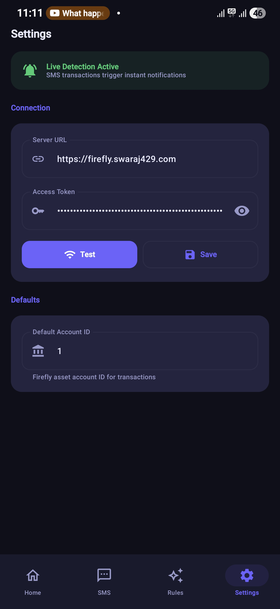
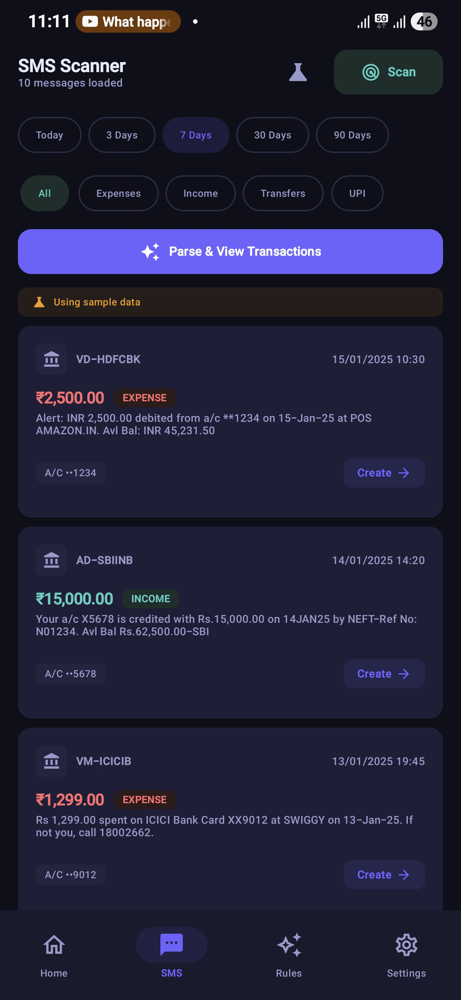
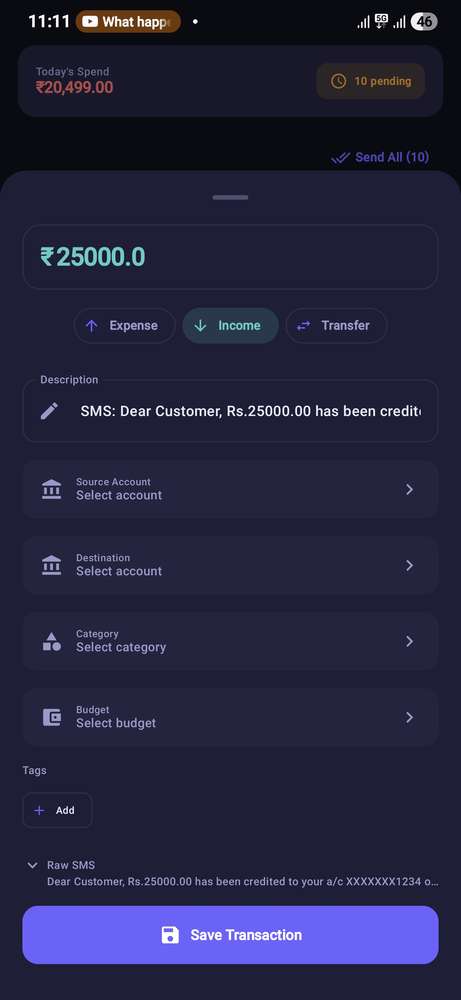
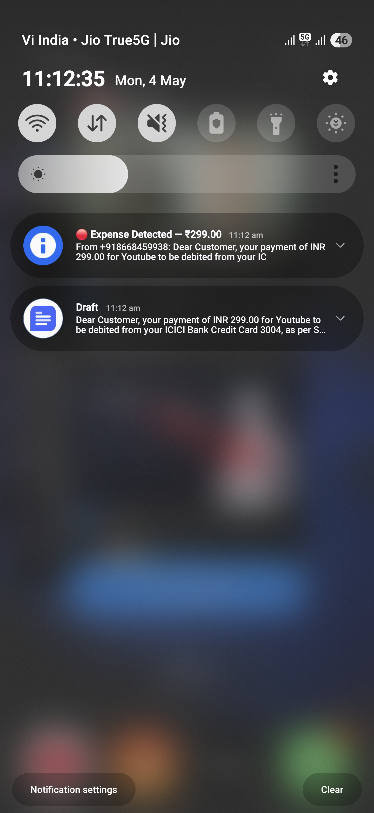
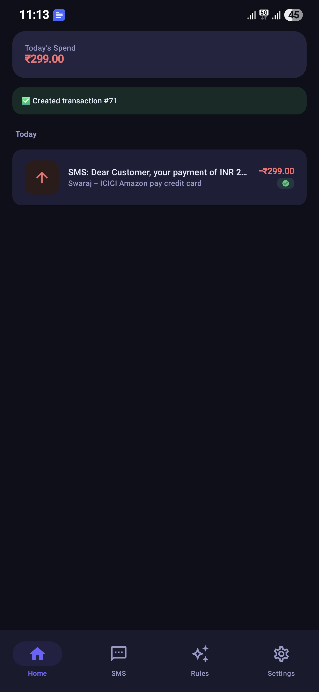

<div align="center">

# 🔥 Firefly III SMS Scanner

**Automatically detect transaction SMS messages and log them to your [Firefly III](https://www.firefly-iii.org/) instance — with one tap.**

[](https://developer.android.com)
[](https://kotlinlang.org)
[](https://developer.android.com/jetpack/compose)
[](LICENSE)
[](CONTRIBUTING.md)
[](https://firefly3smsscanner.swaraj429.com/)

*Stop manually logging every UPI payment, card swipe, and bank transfer.*

</div>

---

## 📸 Screenshots


| Setup Screen | SMS Scanner | Transaction Editor |
|:---:|:---:|:---:|
|  |  |  |

| Notification Alert | Send Result |
|:---:|:---:|
|  |  |

## ✨ Features

### 📩 Real-Time SMS Detection
- Listens for incoming SMS **in the background** using a `BroadcastReceiver`
- Instantly notifies you when a transaction SMS is detected (Indian banking formats)
- Notification includes **"⚡ Send to Firefly"** (auto-submit) and **"Review & Edit"** (tap to open)

### 📅 Unified Home Screen & Date-Range SMS Scanning
- Integrated directly into the Home screen with auto-scan on launch
- Quick-select chips: **This Month**, **Today**, **7 Days**, **30 Days**, **90 Days**
- Spend and income metrics dynamically re-calculate based on active date range and transaction filters

### 🏷️ Intelligent Payee & Merchant Extraction
- 15-tier extraction logic resolves human-readable payee/merchant names from major Indian banks (Axis, ICICI, SBI, BOB, HDFC, RBL, etc.)
- Understands complex patterns: multiline card alerts, UPI credited payees, corporate NEFT salary payouts, FASTag toll plazas, and Simpl PayLater
- UPI VPA dictionary normalization (`fkrt@ybl` → **Flipkart**, `swiggy@...` → **Swiggy**)
- Contextual fallback bank names (e.g., `Bank of Baroda Debit (...6818)`)
- Maps extracted payees directly to Firefly III destination/source accounts for automatic payee creation

### 🚫 Swipe-to-Dismiss & Smart Duplicate Elimination
- Easily dismiss duplicate bank/UPI alerts or credit card bill payment mirror debits
- Dismissal reasons tracked with timestamps (`Duplicate Alert`, `Credit Card Bill`, `Promotional/Other`, `Manual Ignore`)
- Instant Undo via Snackbar and filter toggle to inspect or restore dismissed transactions

### 🧠 Smart Rule-Based Auto-Categorization
- Create customizable IF/THEN automation rules based on sender, message regex, or amount
- Automatically assign categories, budgets, accounts, tags, or mark transactions to be ignored
- Manage rules in the dedicated **Rules** tab

### 🏦 Abacus-Style Transaction Editor
Before submitting, enrich each transaction with:
- **📁 Category** — searchable dropdown from your Firefly categories
- **💼 Budget** — optional budget assignment
- **🏦 Source Account** — your asset accounts
- **🏪 Destination Account** — expense/revenue accounts with free-text fallback
- **🏷️ Tags** — multi-select with checkboxes
- **Description** — prefilled with clean extracted payee, fully editable

### 💾 Persistent Local Storage & Bi-Directional Sync
- Hash-based deduplication ensures identical SMS messages are never duplicated
- Tracks sync status (`PENDING`, `SENT`, `FAILED`) across app restarts
- Automatic 30-day retention pruning keeping storage lightweight
- Full bi-directional sync logic pulls changes made directly on Firefly III back to your local history
- Update already sent transactions right from the app — no need to switch to a browser

---

## 🚀 Getting Started

### Prerequisites

| Requirement | Details |
|---|---|
| **Android** | 8.0 (API 26) or higher |
| **Firefly III** | Self-hosted instance, accessible over your network |
| **Personal Access Token** | Generate at **Profile → OAuth → Personal Access Tokens** in Firefly III |

### Installation

#### Option A — Build from source (recommended for contributors)

```bash
# 1. Clone the repo
git clone https://github.com/swaraj429/firefly-3-sms-auto-scanner.git
cd firefly-3-sms-auto-scanner

# 2. Open in Android Studio (Hedgehog or newer)
# 3. Build & run on your device (USB debugging or wireless ADB)
```

#### Option B — Release APK *(coming soon)*
> A signed release APK will be published on the GitHub Releases page once the project reaches v1.0.

### First Run

1. **Grant permissions** when prompted:
   - `READ_SMS` — to scan your inbox
   - `RECEIVE_SMS` — for real-time detection
   - `POST_NOTIFICATIONS` — to show transaction alerts (Android 13+)

2. **Go to Settings tab → Enter your Firefly III details:**
   - Base URL (e.g. `https://firefly.yourdomain.com`)
   - Personal Access Token
   - Default Account ID (find it in Firefly → Accounts → click your account → note the ID in the URL)

3. **Tap "🔌 Test Connection"** — you should see a green ✅ response

4. **On the Home tab → tap "Sync"** to pull categories, budgets, tags, and accounts

5. **On the Home tab → select a date filter** (e.g. **This Month**, **Today**) — transactions are automatically scanned, parsed, and displayed with clean payee descriptions

---

## 🏗️ Architecture

```
app/
├── db/                 # Room Database (FireflyDatabase, SmsRecordEntity, SmsRecordDao)
├── model/              # Data classes (ParsedTransaction, FireflyModels, ParsingRule, SmsMessage)
├── network/            # Retrofit API interface + client builder
├── parser/             # SmsParser, DescriptionExtractor (15-tier), RuleEngine, AccountMatcher
├── sms/                # SmsReader — ContentResolver queries with date filtering
├── notification/       # SmsReceiver (BroadcastReceiver) + NotificationHelper
├── prefs/              # SharedPreferences wrapper (AppPrefs)
├── viewmodel/          # SmsViewModel, SmsHistoryViewModel, RulesViewModel, TransactionViewModel, FireflyDataViewModel
├── ui/                 # Jetpack Compose UI (HomeScreen, RulesScreen, SettingsScreen)
│                       #   + sheets (TransactionEditorSheet, DismissReasonSheet) + components
└── debug/              # DebugLog — in-memory timestamped log
```

**Tech stack:**
- **Kotlin** + **Coroutines** for async work
- **Jetpack Compose** + **Material3** for UI
- **Room Database** for persistent local transaction caching & dedup
- **Retrofit 2** + **OkHttp 4** for Firefly III API calls
- **Navigation Compose** for screen routing (3-tab: Home, Rules, Settings)
- **ViewModel + SharedPreferences** for state & preferences
- **BroadcastReceiver** for live SMS interception

---

## 🔧 Configuration Reference

| Field | Where to find it |
|---|---|
| **Base URL** | Your Firefly III instance URL (no trailing slash) |
| **Access Token** | Firefly III → Profile → OAuth → Personal Access Tokens → Create |
| **Account ID** | Firefly III → Accounts → click your main account → ID is in the URL |

---

## 🤝 Contributing

Contributions are what make open source great. Whether it's fixing a bug, adding a new bank SMS format, or improving the UI — **all PRs are welcome**.

👉 Please read **[CONTRIBUTING.md](CONTRIBUTING.md)** before opening a pull request.

### Quick ways to help

- 🐛 **[Report a bug](https://github.com/swaraj429/firefly-3-sms-auto-scanner/issues/new?template=bug_report.md)**
- 💡 **[Request a feature](https://github.com/swaraj429/firefly-3-sms-auto-scanner/issues/new?template=feature_request.md)**
- 🏦 **Add support for a new bank SMS format** — see `SmsParser.kt`
- 🌍 **Add localisation** for non-Indian banking formats
- 📝 **Improve documentation**

---

- [x] **v0.0.1-alpha** — Real-time SMS detection, parser, and basic UI
- [x] **v0.0.2** — Tabbed navigation, Smart Rules, and improved editor
- [x] **v0.0.3-alpha** — Persistent SMS history (Room DB), hash-based deduplication, in-app Database Viewer, and fixed Account Auto-matching
- [x] **v0.0.4-alpha** — Dismissal & restore workflows, advanced rule builder UI
- [x] **v0.0.5-alpha** — Bi-directional Firefly III sync, updating sent transactions, and UI uncluttering
- [ ] **v1.0** — Stable release + signed APK
- [ ] Auto-send mode (skip review, send all transactions instantly)
- [ ] Support for multiple Firefly III accounts
- [ ] Widget showing today's spend
- [ ] Import from CSV/bank statement
- [ ] Support non-Indian SMS formats (EU, US bank patterns)

---

## ⚠️ Privacy & Security

- **No data leaves your device** except to your own Firefly III instance
- SMS content is processed entirely on-device
- No analytics, no crash reporting, no third-party SDKs (other than OkHttp/Retrofit)
- Your access token is stored in **SharedPreferences** — consider using Android Keystore for production hardening (contributions welcome!)

---

## 📄 License

This project is licensed under the MIT License - see the [LICENSE](LICENSE) file for details.

---

## 🙏 Acknowledgements

- [Firefly III](https://www.firefly-iii.org/) — the excellent self-hosted finance manager this app is built around
- [James Cole](https://github.com/JC5) — Firefly III creator
- Indian banking community for SMS format research

---

<div align="center">

**If this project helps you, please ⭐ star it on GitHub — it really helps!**

Made with ❤️ for the self-hosted finance community

</div>
