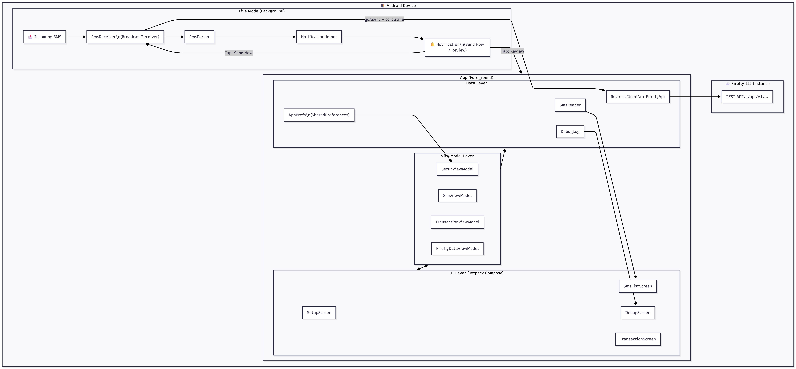
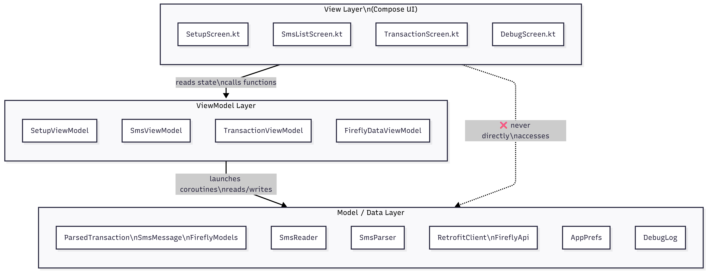
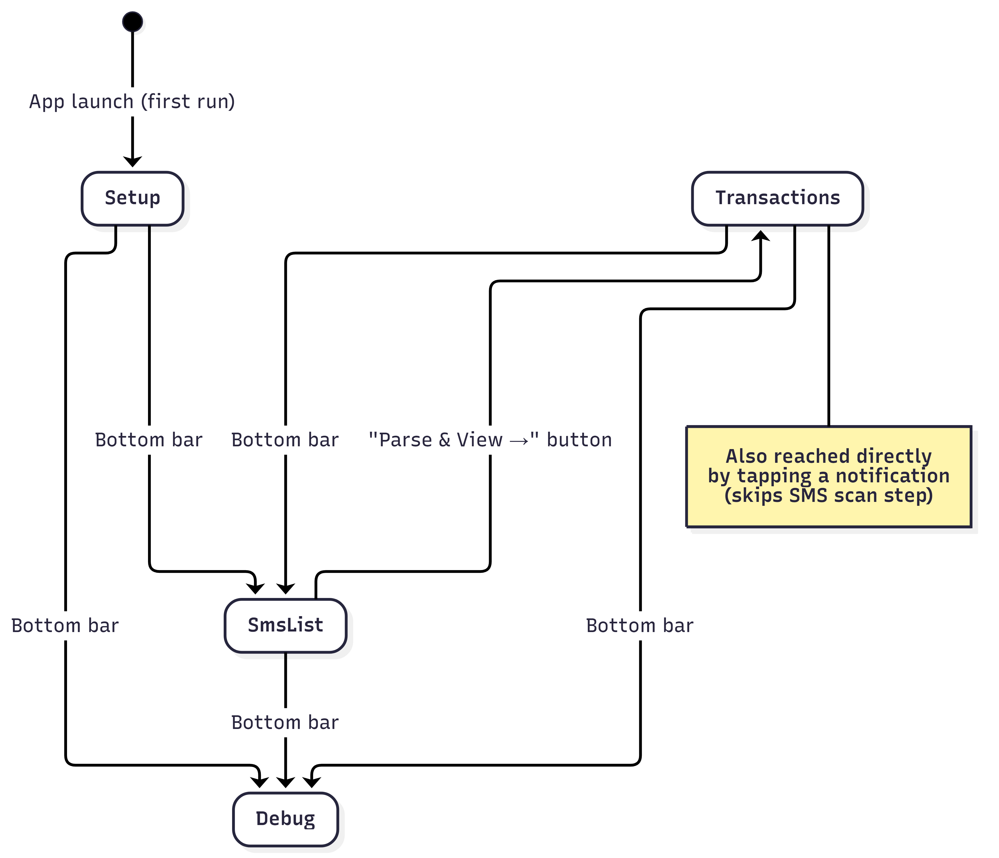
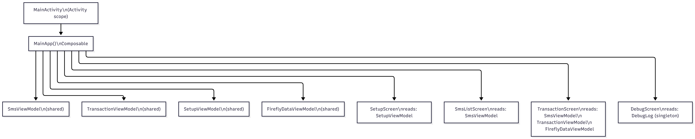
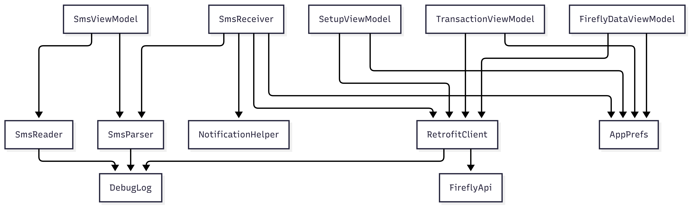

# 🏛️ Architecture Overview

This document explains the system design of Firefly III SMS Scanner — how the layers relate to each other, what responsibilities each component has, and why key design decisions were made.

---

## The Big Picture

The app has two independent operational modes that share the same ViewModel layer:

1. **Manual mode** — user opens the app, scans SMS inbox by date range, reviews parsed transactions, enriches them with Firefly metadata, and submits
2. **Live mode** — a background `BroadcastReceiver` intercepts every incoming SMS, parses it on the spot, and notifies the user without the app being open



---

## Layered Architecture

The project follows **MVVM (Model-View-ViewModel)** strictly. Here's what each layer is and is not allowed to do:



### Rules enforced in this codebase

| Rule | Reason |
|---|---|
| Screens never import `SmsReader`, `RetrofitClient`, etc. | Keeps UI layer thin and testable |
| ViewModels never import Compose (`@Composable`) | Prevents VM from being tied to the UI lifecycle |
| All Compose `mutableStateOf` mutations happen on the main thread | Prevents `IllegalStateException` from Compose snapshot system |
| `BroadcastReceiver` uses `goAsync()` for all network work | Android kills the receiver after `onReceive()` returns without it |

---

## Component Inventory

### Application Class — `FireflyApp.kt`

The custom `Application` subclass is registered in `AndroidManifest.xml` via `android:name=".FireflyApp"`. It runs before any Activity or BroadcastReceiver.

**Responsibilities:**
- Creates the `"firefly_transactions"` notification channel on startup
- This is the only safe place to create a notification channel — it's idempotent and must be done before any notification is shown

### Entry Points

| Component | Class | Trigger |
|---|---|---|
| Main UI | `MainActivity` | User launches app, or taps "Review" on notification |
| SMS listener | `SmsReceiver` | Android dispatches `SMS_RECEIVED_ACTION` broadcast |
| Notification actions | `SmsReceiver` | User taps "Send Now" or "Dismiss" on a notification |

---

## Screen Navigation

The app uses **Navigation Compose** with a single bottom navigation bar. Screens are simple destinations — no nested graphs, no deep links (except from the notification).



### Notification → App Navigation

When a transaction notification is tapped:

1. `NotificationHelper` creates a `PendingIntent` targeting `MainActivity` with `action = ACTION_REVIEW_TRANSACTION` and all transaction data as Intent extras
2. If the app is **not running** → `MainActivity.onCreate()` is called, which calls `handleNotificationIntent()`
3. If the app is **already running** → `MainActivity.onNewIntent()` is called, which also calls `handleNotificationIntent()`
4. `handleNotificationIntent()` reconstructs a `ParsedTransaction` from the extras and stores it in `pendingNotificationTransaction: MutableState<ParsedTransaction?>`
5. A `LaunchedEffect` in `MainApp()` observes this state — when non-null, it calls `smsViewModel.addTransactionFromNotification(tx)` and navigates to the Transactions tab

This approach avoids any singleton, static variable, or `Intent` passing to a ViewModel (which is an anti-pattern).

---

## ViewModel Ownership

All ViewModels are created by `viewModel()` in `MainApp()`, which means they're scoped to the **Activity** lifecycle. This is intentional — the same `SmsViewModel` instance is shared across the SMS tab and Transaction tab, so parsed transactions persist through tab navigation.



---

## Dependency Graph (simplified)



All network calls go through `RetrofitClient.create()`. It is **not** a singleton — it's recreated on demand with the current `baseUrl` and `accessToken` from `AppPrefs`. This means config changes take effect immediately without restarting.

---

## Key Design Decisions

### Why not use a Service for live SMS detection?

Android 8+ (API 26) severely restricts background services for apps not in the foreground. A `BroadcastReceiver` is the correct Android primitive for reacting to system events like `SMS_RECEIVED`. The receiver is:
- Declared in `AndroidManifest.xml` (not registered dynamically)
- Stateless — it creates nothing persistent, just posts a notification
- Extended with `goAsync()` to safely perform a network call on a coroutine without being killed

### Why is `DebugLog` a global singleton and not a ViewModel?

`DebugLog` needs to receive log entries from `RetrofitClient` interceptors running on OkHttp's background threads, from `SmsReceiver` (which has no ViewModel), and from all ViewModels — before any screen is open. A ViewModel's lifecycle is too short and too narrowly scoped. The singleton is safe because:
- Writes to the backing list use `CopyOnWriteArrayList` (thread-safe)
- Mutations to Compose observable state (`mutableStateListOf`) are always posted to the main thread via `Handler(Looper.getMainLooper())`

### Why is `RetrofitClient` not a singleton?

The base URL and access token can be changed at any time in the Setup screen. Making `RetrofitClient` a singleton would require an invalidation/reset mechanism. Instead, a new client is cheaply constructed per-call. OkHttp connection pooling is not lost because Android's default DNS and connection pool operates at the OS level.

### Why SharedPreferences and not DataStore?

The project deliberately keeps its dependency footprint minimal. `AppPrefs` is a thin wrapper around `SharedPreferences` with synchronous reads and async (`apply()`) writes — suitable for the simple key-value config this app stores. Migration to `DataStore` is a tracked roadmap item.

---

## SMS History — 30-Day Record Store

### Problem

Previously, parsed transactions lived only in `SmsViewModel.parsedTransactions` (in-memory). Closing the app meant losing all state. The user had no way to know which transactions were already sent to Firefly.

### Solution

A new Room table `sms_records` persists every parsed transaction with:

| Column | Purpose |
|---|---|
| `smsHash` (unique index) | SHA-256 of `sender + body` — prevents duplicate records even if the same SMS is scanned multiple times |
| `syncStatus` | `PENDING` / `SENT` / `FAILED` — tracks Firefly submission state |
| `fireflyTransactionId` | The Firefly `data.id` returned on a successful POST |
| `smsTimestamp` | Original SMS timestamp used for 30-day retention cutoff |

### Deduplication Strategy

```
hash = SHA-256("sender|body")
INSERT OR IGNORE INTO sms_records ...
```

The `IGNORE` conflict strategy on the unique `smsHash` index means scanning the same date range multiple times is safe — no duplicates are created.

### Auto-Scan on Launch

`MainActivity.LaunchedEffect(Unit)` now automatically:

1. Sets `SmsViewModel.fromDate` to 30 days ago and `toDate` to now
2. Calls `loadSmsByDateRange()` (if SMS permission is granted)
3. When messages load, a second `LaunchedEffect` auto-parses them with account matching
4. `SmsViewModel.parseMessages()` calls `SmsHistoryViewModel.saveTransactions()` to persist results

### Sync Status Lifecycle

```
PENDING  ─(sendTransaction success)─→  SENT
PENDING  ─(sendTransaction failure)─→  FAILED
FAILED   ─(user retries)─────────────→  PENDING → ...
```

`TransactionViewModel.sendTransaction()` accepts an optional `SmsHistoryViewModel` reference and updates the Room record after each API call.

### Retention / Cleanup

On every `SmsHistoryViewModel.loadHistory()` call:

1. `DELETE FROM sms_records WHERE smsTimestamp < :30daysAgo`
2. Then `SELECT * WHERE smsTimestamp >= :30daysAgo ORDER BY smsTimestamp DESC`

### HomeScreen Changes

The Home tab now displays the **persisted history** (not just in-memory parsed data) with:

- **Summary banner** showing total spend, income, and status pill counts (Pending/Sent/Failed)
- **Filter chips**: All / Pending / Sent / Failed
- **Bulk Send All** for pending transactions
- If no history exists yet, a prompt directs to the SMS tab
