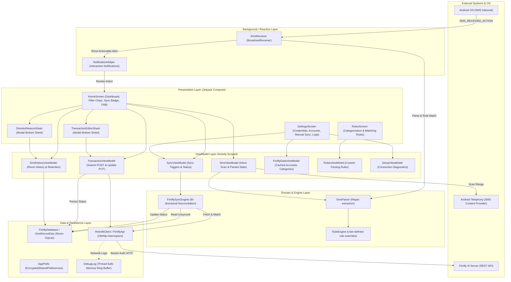
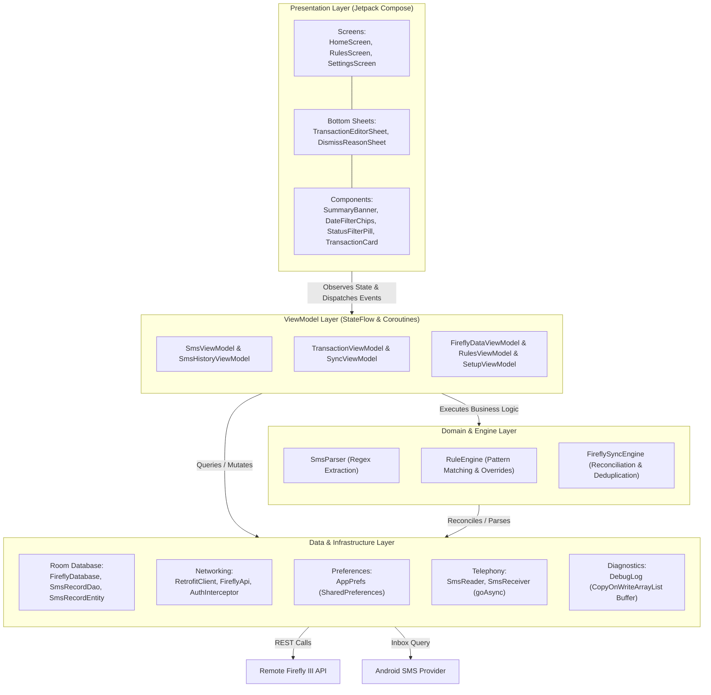
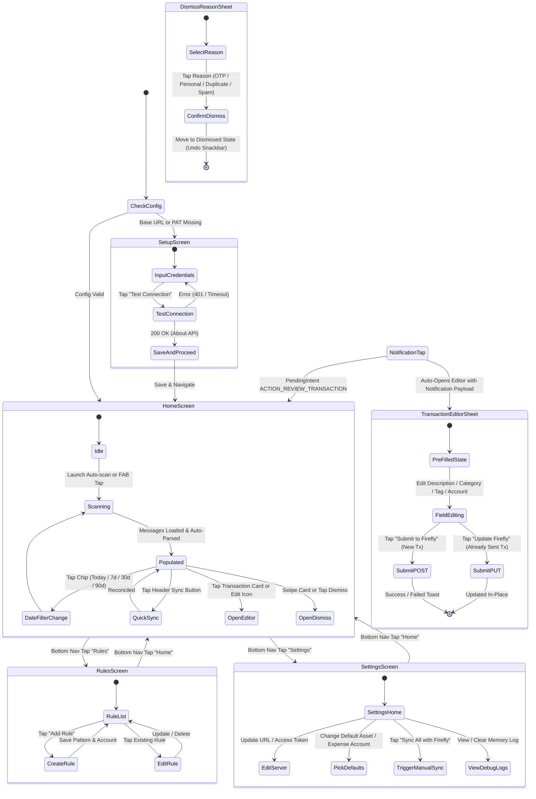
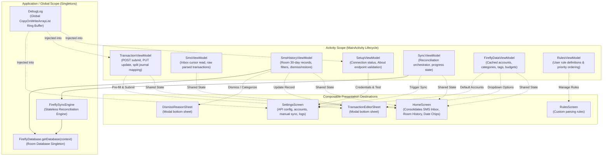
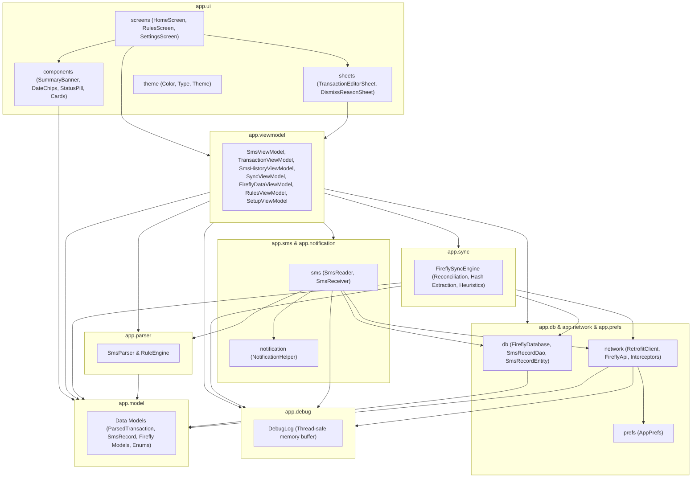
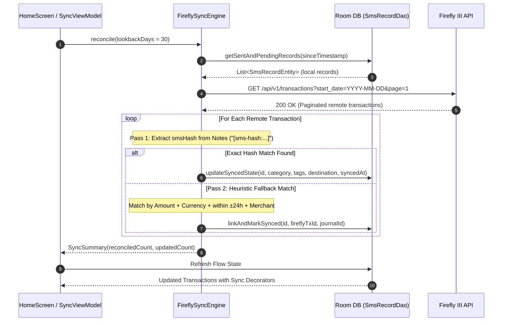

# 🏛️ Architecture Overview

This document explains the system design of Firefly III SMS Scanner — how the layers relate to each other, what responsibilities each component has, and why key design decisions were made.

---

## The Big Picture

The app has two independent operational modes that share the same ViewModel layer:

1. **Manual mode** — user opens the app, scans SMS inbox by date range, reviews parsed transactions, enriches them with Firefly metadata, and submits
2. **Live mode** — a background `BroadcastReceiver` intercepts every incoming SMS, parses it on the spot, and notifies the user without the app being open


```mermaid
flowchart TB
    subgraph External["External Systems & OS"]
        OS_SMS["Android OS (SMS Inbound)"]
        OS_CP["Android Telephony (SMS Content Provider)"]
        FIREFLY["Firefly III Server (REST API)"]
    end

    subgraph Reactive["Background / Reactive Layer"]
        RECEIVER["SmsReceiver (BroadcastReceiver)"]
        NOTIF["NotificationHelper (Interactive Notifications)"]
    end

    subgraph UI["Presentation Layer (Jetpack Compose)"]
        HOME["HomeScreen (Dashboard, Filter Chips, Sync Badge, FAB)"]
        RULES["RulesScreen (Categorization & Matching Rules)"]
        SETTINGS["SettingsScreen (Credentials, Accounts, Manual Sync, Logs)"]
        SHEET_EDIT["TransactionEditorSheet (Modal Bottom Sheet)"]
        SHEET_DISMISS["DismissReasonSheet (Modal Bottom Sheet)"]
    end

    subgraph VM["ViewModel Layer (Activity Scoped)"]
        VM_SMS["SmsViewModel (Inbox Scan & Parsed State)"]
        VM_TX["TransactionViewModel (Submit POST & Update PUT)"]
        VM_HIST["SmsHistoryViewModel (Room History & Retention)"]
        VM_SYNC["SyncViewModel (Sync Triggers & Status)"]
        VM_DATA["FireflyDataViewModel (Cached Accounts, Categories)"]
        VM_RULES["RulesViewModel (Custom Parsing Rules)"]
        VM_SETUP["SetupViewModel (Connection Diagnostics)"]
    end

    subgraph Domain["Domain & Engine Layer"]
        PARSER["SmsParser (Regex extraction)"]
        RULE_ENG["RuleEngine (User-defined rule overrides)"]
        SYNC_ENG["FireflySyncEngine (Bi-directional Reconciliation)"]
    end

    subgraph DataLayer["Data & Persistence Layer"]
        ROOM["FireflyDatabase / SmsRecordDao (Room SQLite)"]
        PREFS["AppPrefs (EncryptedSharedPreferences)"]
        RETROFIT["RetrofitClient / FireflyApi (OkHttp Interceptors)"]
        DEBUG_LOG["DebugLog (Thread-Safe Memory Ring Buffer)"]
    end

    %% Wiring
    OS_SMS -->|"SMS_RECEIVED_ACTION"| RECEIVER
    RECEIVER -->|"Parse & Rule Match"| PARSER
    RECEIVER -->|"Show Actionable Alert"| NOTIF
    NOTIF -->|"Review Intent"| HOME

    HOME --> VM_SMS
    HOME --> VM_TX
    HOME --> VM_HIST
    HOME --> VM_SYNC
    HOME --> SHEET_EDIT
    HOME --> SHEET_DISMISS

    RULES --> VM_RULES
    SETTINGS --> VM_SETUP
    SETTINGS --> VM_SYNC
    SETTINGS --> VM_DATA

    SHEET_EDIT --> VM_TX
    SHEET_DISMISS --> VM_HIST

    VM_SMS -->|"Scan Range"| OS_CP
    VM_SMS --> PARSER
    PARSER --> RULE_ENG

    VM_TX --> RETROFIT
    VM_TX -->|"Persist Status"| ROOM
    VM_HIST --> ROOM

    VM_SYNC --> SYNC_ENG
    SYNC_ENG -->|"Read Unsynced"| ROOM
    SYNC_ENG -->|"Fetch & Match"| RETROFIT
    SYNC_ENG -->|"Update Status"| ROOM

    RETROFIT -->|"Bearer Auth HTTP"| FIREFLY
    RETROFIT -.->|"Network Logs"| DEBUG_LOG
```

---

## Layered Architecture

The project follows **MVVM (Model-View-ViewModel)** strictly. Here's what each layer is and is not allowed to do:


```mermaid
flowchart TB
    subgraph Presentation["Presentation Layer (Jetpack Compose)"]
        direction TB
        Screens["Screens:\nHomeScreen, RulesScreen, SettingsScreen"]
        Sheets["Bottom Sheets:\nTransactionEditorSheet, DismissReasonSheet"]
        Widgets["Components:\nSummaryBanner, DateFilterChips, StatusFilterPill, TransactionCard"]
        Screens --- Sheets --- Widgets
    end

    subgraph ViewModels["ViewModel Layer (StateFlow & Coroutines)"]
        direction TB
        V_Home["SmsViewModel & SmsHistoryViewModel"]
        V_Tx["TransactionViewModel & SyncViewModel"]
        V_Data["FireflyDataViewModel & RulesViewModel & SetupViewModel"]
    end

    subgraph DomainServices["Domain & Engine Layer"]
        direction TB
        E_Parser["SmsParser (Regex Extraction)"]
        E_Rules["RuleEngine (Pattern Matching & Overrides)"]
        E_Sync["FireflySyncEngine (Reconciliation & Deduplication)"]
    end

    subgraph DataInfrastructure["Data & Infrastructure Layer"]
        direction TB
        D_Room["Room Database:\nFireflyDatabase, SmsRecordDao, SmsRecordEntity"]
        D_Net["Networking:\nRetrofitClient, FireflyApi, AuthInterceptor"]
        D_Prefs["Preferences:\nAppPrefs (SharedPreferences)"]
        D_Sms["Telephony:\nSmsReader, SmsReceiver (goAsync)"]
        D_Diag["Diagnostics:\nDebugLog (CopyOnWriteArrayList Buffer)"]
    end

    Presentation -->|"Observes State & Dispatches Events"| ViewModels
    ViewModels -->|"Executes Business Logic"| DomainServices
    ViewModels -->|"Queries / Mutates"| DataInfrastructure
    DomainServices -->|"Reconciles / Parses"| DataInfrastructure
    DataInfrastructure -->|"REST Calls"| Remote["Remote Firefly III API"]
    DataInfrastructure -->|"Inbox Query"| LocalSMS["Android SMS Provider"]
```

### Rules enforced in this codebase

| Rule | Reason |
|---|---|
| Screens never import `SmsReader`, `RetrofitClient`, etc. | Keeps UI layer thin and testable |
| ViewModels never import Compose (`@Composable`) | Prevents VM from being tied to the UI lifecycle |
| All Compose `mutableStateOf` mutations happen on the main thread | Prevents `IllegalStateException` from Compose snapshot system |
| `BroadcastReceiver` uses `goAsync()` for all network work | Android kills the receiver after `onReceive()` returns without it |

---

## Component Inventory

### Application Class — `FireflyApp.kt`

The custom `Application` subclass is registered in `AndroidManifest.xml` via `android:name=".FireflyApp"`. It runs before any Activity or BroadcastReceiver.

**Responsibilities:**
- Creates the `"firefly_transactions"` notification channel on startup
- This is the only safe place to create a notification channel — it's idempotent and must be done before any notification is shown

### Entry Points & Core Components

| Component | Class | Trigger / Responsibility |
|---|---|---|
| Main UI | `MainActivity` | User launches app, or taps "Review" on notification |
| SMS listener | `SmsReceiver` | Android dispatches `SMS_RECEIVED_ACTION` broadcast |
| Notification actions | `SmsReceiver` | User taps "Send Now" or "Dismiss" on a notification |
| Persistence | `FireflyDatabase` / `SmsRecordDao` | Room DB for 30-day transactional history and deduplication |
| Bi-directional Sync | `FireflySyncEngine` | Reconciles remote Firefly state with local Room records |

---

## Screen Navigation

The app uses **Navigation Compose** with a single bottom navigation bar. Starting in Alpha 4, the navigation consists of 3 primary tabs: **Home**, **Rules**, and **Settings**. SMS scanning is unified directly into the Home screen.


```mermaid
stateDiagram-v2
    [*] --> CheckConfig

    state CheckConfig <<choice>>
    CheckConfig --> SetupScreen: Base URL or PAT Missing
    CheckConfig --> HomeScreen: Config Valid

    state SetupScreen {
        [*] --> InputCredentials
        InputCredentials --> TestConnection: Tap "Test Connection"
        TestConnection --> InputCredentials: Error (401 / Timeout)
        TestConnection --> SaveAndProceed: 200 OK (About API)
    }
    SaveAndProceed --> HomeScreen: Save & Navigate

    state HomeScreen {
        [*] --> Idle
        Idle --> Scanning: Launch Auto-scan or FAB Tap
        Scanning --> Populated: Messages Loaded & Auto-Parsed
        Populated --> DateFilterChange: Tap Chip (Today / 7d / 30d / 90d)
        DateFilterChange --> Scanning

        Populated --> QuickSync: Tap Header Sync Button
        QuickSync --> Populated: Reconciled

        Populated --> OpenEditor: Tap Transaction Card or Edit Icon
        Populated --> OpenDismiss: Swipe Card or Tap Dismiss
    }

    state TransactionEditorSheet {
        [*] --> PreFilledState
        PreFilledState --> FieldEditing: Edit Description / Category / Tag / Account
        FieldEditing --> SubmitPOST: Tap "Submit to Firefly" (New Tx)
        FieldEditing --> SubmitPUT: Tap "Update Firefly" (Already Sent Tx)
        SubmitPOST --> [*]: Success / Failed Toast
        SubmitPUT --> [*]: Updated In-Place
    }

    state DismissReasonSheet {
        [*] --> SelectReason
        SelectReason --> ConfirmDismiss: Tap Reason (OTP / Personal / Duplicate / Spam)
        ConfirmDismiss --> [*]: Move to Dismissed State (Undo Snackbar)
    }

    state RulesScreen {
        [*] --> RuleList
        RuleList --> CreateRule: Tap "Add Rule"
        RuleList --> EditRule: Tap Existing Rule
        CreateRule --> RuleList: Save Pattern & Account
        EditRule --> RuleList: Update / Delete
    }

    state SettingsScreen {
        [*] --> SettingsHome
        SettingsHome --> EditServer: Update URL / Access Token
        SettingsHome --> PickDefaults: Change Default Asset / Expense Account
        SettingsHome --> TriggerManualSync: Tap "Sync All with Firefly"
        SettingsHome --> ViewDebugLogs: View / Clear Memory Log
    }

    HomeScreen --> RulesScreen: Bottom Nav Tap "Rules"
    RulesScreen --> HomeScreen: Bottom Nav Tap "Home"
    HomeScreen --> SettingsScreen: Bottom Nav Tap "Settings"
    SettingsScreen --> HomeScreen: Bottom Nav Tap "Home"

    NotificationTap --> HomeScreen: PendingIntent ACTION_REVIEW_TRANSACTION
    NotificationTap --> TransactionEditorSheet: Auto-Opens Editor with Notification Payload
```

### Notification → App Navigation

When a transaction notification is tapped:

1. `NotificationHelper` creates a `PendingIntent` targeting `MainActivity` with `action = ACTION_REVIEW_TRANSACTION` and all transaction data as Intent extras
2. If the app is **not running** → `MainActivity.onCreate()` is called, which calls `handleNotificationIntent()`
3. If the app is **already running** → `MainActivity.onNewIntent()` is called, which also calls `handleNotificationIntent()`
4. `handleNotificationIntent()` reconstructs a `ParsedTransaction` from the extras and stores it in `pendingNotificationTransaction: MutableState<ParsedTransaction?>`
5. A `LaunchedEffect` in `MainApp()` observes this state — when non-null, it calls `smsViewModel.addTransactionFromNotification(tx)` and opens the transaction in the Home tab

This approach avoids any singleton, static variable, or `Intent` passing to a ViewModel (which is an anti-pattern).

---

## ViewModel Ownership

All ViewModels are created by `viewModel()` in `MainApp()`, which means they're scoped to the **Activity** lifecycle. This is intentional — ViewModels are shared across screens and composable sheets, so state persists across tab navigation.


```mermaid
flowchart TD
    subgraph Scope_Activity["Activity Scope (MainActivity Lifecycle)"]
        VM_Setup["SetupViewModel\n(Connection status, About endpoint validation)"]
        VM_Sms["SmsViewModel\n(Inbox cursor read, raw parsed transactions)"]
        VM_History["SmsHistoryViewModel\n(Room 30-day records, filters, dismiss/restore)"]
        VM_Tx["TransactionViewModel\n(POST submit, PUT update, split journal mapping)"]
        VM_Sync["SyncViewModel\n(Reconciliation orchestrator, progress state)"]
        VM_Data["FireflyDataViewModel\n(Cached accounts, categories, tags, budgets)"]
        VM_Rules["RulesViewModel\n(User rule definitions & priority ordering)"]
    end

    subgraph Composables["Composable Presentation Destinations"]
        Screen_Home["HomeScreen\n(Consolidates SMS Inbox, Room History, Date Chips)"]
        Screen_Rules["RulesScreen\n(Custom parsing rules)"]
        Screen_Settings["SettingsScreen\n(API config, accounts, manual sync, logs)"]
        Sheet_TxEditor["TransactionEditorSheet\n(Modal bottom sheet)"]
        Sheet_Dismiss["DismissReasonSheet\n(Modal bottom sheet)"]
    end

    subgraph Scope_Global["Application / Global Scope (Singletons)"]
        DB_Instance["FireflyDatabase.getDatabase(context)\n(Room Database Singleton)"]
        LOG_Instance["DebugLog\n(Global CopyOnWriteArrayList Ring Buffer)"]
        ENGINE_Instance["FireflySyncEngine\n(Stateless Reconciliation Engine)"]
    end

    %% Sharing
    VM_Sms -.->|"Shared State"| Screen_Home
    VM_History -.->|"Shared State"| Screen_Home
    VM_Tx -.->|"Shared State"| Screen_Home
    VM_Sync -.->|"Shared State"| Screen_Home
    VM_Data -.->|"Shared State"| Screen_Home

    VM_Tx -.->|"Pre-fill & Submit"| Sheet_TxEditor
    VM_Data -.->|"Dropdown Options"| Sheet_TxEditor
    VM_History -.->|"Update Record"| Sheet_TxEditor

    VM_History -.->|"Dismiss / Categorize"| Sheet_Dismiss

    VM_Rules -.->|"Manage Rules"| Screen_Rules

    VM_Setup -.->|"Credentials & Test"| Screen_Settings
    VM_Sync -.->|"Trigger Sync"| Screen_Settings
    VM_Data -.->|"Default Accounts"| Screen_Settings

    VM_History --> DB_Instance
    VM_Sync --> ENGINE_Instance
    ENGINE_Instance --> DB_Instance

    LOG_Instance -.->|"Injected into"| VM_Setup
    LOG_Instance -.->|"Injected into"| VM_Tx
    LOG_Instance -.->|"Injected into"| Screen_Settings
```

---

## Dependency Graph (simplified)


```mermaid
flowchart TD
    subgraph Package_UI["app.ui"]
        UI_Screens["screens (HomeScreen, RulesScreen, SettingsScreen)"]
        UI_Sheets["sheets (TransactionEditorSheet, DismissReasonSheet)"]
        UI_Components["components (SummaryBanner, DateChips, StatusPill, Cards)"]
        UI_Theme["theme (Color, Type, Theme)"]
    end

    subgraph Package_ViewModel["app.viewmodel"]
        VMs["SmsViewModel, TransactionViewModel, SmsHistoryViewModel,\nSyncViewModel, FireflyDataViewModel, RulesViewModel, SetupViewModel"]
    end

    subgraph Package_Sync["app.sync"]
        SyncEngine["FireflySyncEngine (Reconciliation, Hash Extraction, Heuristics)"]
    end

    subgraph Package_Domain["app.parser"]
        Parser["SmsParser & RuleEngine"]
    end

    subgraph Package_Data["app.db & app.network & app.prefs"]
        DB["db (FireflyDatabase, SmsRecordDao, SmsRecordEntity)"]
        Network["network (RetrofitClient, FireflyApi, Interceptors)"]
        Prefs["prefs (AppPrefs)"]
    end

    subgraph Package_Background["app.sms & app.notification"]
        SMS_Bg["sms (SmsReader, SmsReceiver)"]
        Notif["notification (NotificationHelper)"]
    end

    subgraph Package_Debug["app.debug"]
        Debug["DebugLog (Thread-safe memory buffer)"]
    end

    subgraph Package_Model["app.model"]
        Models["Data Models (ParsedTransaction, SmsRecord, Firefly Models, Enums)"]
    end

    %% Dependencies
    UI_Screens --> Package_ViewModel
    UI_Sheets --> Package_ViewModel
    UI_Components --> Package_Model
    UI_Screens --> UI_Sheets
    UI_Screens --> UI_Components

    Package_ViewModel --> Package_Domain
    Package_ViewModel --> Package_Sync
    Package_ViewModel --> Package_Data
    Package_ViewModel --> Package_Background
    Package_ViewModel --> Package_Debug
    Package_ViewModel --> Package_Model

    Package_Sync --> DB
    Package_Sync --> Network
    Package_Sync --> Package_Model
    Package_Sync --> Package_Debug

    SMS_Bg --> Package_Domain
    SMS_Bg --> DB
    SMS_Bg --> Notif
    SMS_Bg --> Network
    SMS_Bg --> Package_Debug

    Package_Domain --> Package_Model
    DB --> Package_Model
    Network --> Prefs
    Network --> Package_Debug
    Network --> Package_Model
```

All network calls go through `RetrofitClient.create()`. It is **not** a singleton — it's recreated on demand with the current `baseUrl` and `accessToken` from `AppPrefs`. This means config changes take effect immediately without restarting.

---

## Key Design Decisions

### Why not use a Service for live SMS detection?

Android 8+ (API 26) severely restricts background services for apps not in the foreground. A `BroadcastReceiver` is the correct Android primitive for reacting to system events like `SMS_RECEIVED`. The receiver is:
- Declared in `AndroidManifest.xml` (not registered dynamically)
- Stateless — it creates nothing persistent, just posts a notification
- Extended with `goAsync()` to safely perform a network call on a coroutine without being killed

### Why is `DebugLog` a global singleton and not a ViewModel?

`DebugLog` needs to receive log entries from `RetrofitClient` interceptors running on OkHttp's background threads, from `SmsReceiver` (which has no ViewModel), and from all ViewModels — before any screen is open. A ViewModel's lifecycle is too short and too narrowly scoped. The singleton is safe because:
- Writes to the backing list use `CopyOnWriteArrayList` (thread-safe)
- Mutations to Compose observable state (`mutableStateListOf`) are always posted to the main thread via `Handler(Looper.getMainLooper())`

### Why is `RetrofitClient` not a singleton?

The base URL and access token can be changed at any time in the Setup screen. Making `RetrofitClient` a singleton would require an invalidation/reset mechanism. Instead, a new client is cheaply constructed per-call. OkHttp connection pooling is not lost because Android's default DNS and connection pool operates at the OS level.

### Why SharedPreferences and not DataStore?

The project deliberately keeps its dependency footprint minimal. `AppPrefs` is a thin wrapper around `SharedPreferences` with synchronous reads and async (`apply()`) writes — suitable for the simple key-value config this app stores. Migration to `DataStore` is a tracked roadmap item.

---

## SMS History — 30-Day Record Store

### Problem

Previously, parsed transactions lived only in `SmsViewModel.parsedTransactions` (in-memory). Closing the app meant losing all state. The user had no way to know which transactions were already sent to Firefly.

### Solution

A Room table `sms_records` persists every parsed transaction with:

| Column | Purpose |
|---|---|
| `smsHash` (unique index) | SHA-256 of `sender + body` — prevents duplicate records even if the same SMS is scanned multiple times |
| `syncStatus` | `PENDING` / `SENT` / `FAILED` / `DISMISSED` — tracks Firefly submission & review state |
| `fireflyTransactionId` | The Firefly group `data.id` returned on a successful POST/PUT |
| `fireflyTransactionJournalId` | The split transaction journal ID used to target `PUT` updates |
| `lastSyncedAt` | Epoch timestamp of last successful sync/reconciliation with Firefly |
| `remoteDescription`, `remoteTags`, `remoteCategory` | Remote state cached to detect remote edits and keep local DB in sync |
| `dismissReason`, `dismissedAt` | Reason code and timestamp if user dismissed the transaction |
| `smsTimestamp` | Original SMS timestamp used for 30-day retention cutoff |

### Deduplication Strategy

```
hash = SHA-256("sender|body")
INSERT OR IGNORE INTO sms_records ...
```

The `IGNORE` conflict strategy on the unique `smsHash` index means scanning the same date range multiple times is safe — no duplicates are created.

### Auto-Scan on Launch

`MainActivity.LaunchedEffect(Unit)` now automatically:

1. Sets `SmsViewModel.fromDate` to 30 days ago and `toDate` to now
2. Calls `loadSmsByDateRange()` (if SMS permission is granted)
3. When messages load, a second `LaunchedEffect` auto-parses them with account matching
4. `SmsViewModel.parseMessages()` calls `SmsHistoryViewModel.saveTransactions()` to persist results
5. Triggers `FireflySyncEngine.reconcile()` if the last sync was more than 12 hours ago

### Sync Status Lifecycle

```
PENDING    ──(POST createTransaction success)──→  SENT
PENDING    ──(POST createTransaction failure)──→  FAILED
FAILED     ──(user retries)────────────────────→  PENDING → ...
SENT       ──(PUT updateTransaction)───────────→  SENT (updated in-place)
PENDING    ──(user dismisses)──────────────────→  DISMISSED
DISMISSED  ──(user restores / sends)───────────→  PENDING / SENT
```

`TransactionViewModel` accepts an optional `SmsHistoryViewModel` reference and updates the Room record after each `POST` or `PUT` API call.

### Retention / Cleanup

On every `SmsHistoryViewModel.loadHistory()` call:

1. `DELETE FROM sms_records WHERE smsTimestamp < :30daysAgo`
2. Then `SELECT * WHERE smsTimestamp >= :30daysAgo ORDER BY smsTimestamp DESC`

### Bi-Directional Reconciliation (`FireflySyncEngine`)

To ensure parity between local storage and Firefly III (even across app re-installs or edits made in the Firefly web interface):

1. **Hash in Notes**: Outbound transactions embed `smsHash=<sha256>` in the transaction `notes` field.
2. **Periodic & Triggered Execution**: Runs automatically on app launch (if >12 hours old) or when tapping the sync button on the Home screen.
3. **Dual Matching Engine**:
   - Matches transactions by extracting `smsHash` from remote notes.
   - Falls back to heuristic matching (amount, type, and 24-hour timestamp window).
4. **Local Sync-Back**:
   - Updates local metadata (`category`, `tags`, `description`, `accounts`, `budget`) if modified in Firefly.
   - Advances `PENDING` / `FAILED` records to `SENT` if found in Firefly, recovering previous sync states without duplicate submissions.


```mermaid
sequenceDiagram
    autonumber
    participant UI as HomeScreen / SyncViewModel
    participant Engine as FireflySyncEngine
    participant DB as Room DB (SmsRecordDao)
    participant API as Firefly III API

    UI->>Engine: reconcile(lookbackDays = 30)
    Engine->>DB: getSentAndPendingRecords(sinceTimestamp)
    DB-->>Engine: List<SmsRecordEntity> (local records)

    Engine->>API: GET /api/v1/transactions?start_date=YYYY-MM-DD&page=1
    API-->>Engine: 200 OK (Paginated remote transactions)

    loop For Each Remote Transaction
        Note over Engine: Pass 1: Extract smsHash from Notes ("[sms-hash:...]")
        alt Exact Hash Match Found
            Engine->>DB: updateSyncedState(id, category, tags, destination, syncedAt)
        else Pass 2: Heuristic Fallback Match
            Note over Engine: Match by Amount + Currency + within ±24h + Merchant
            Engine->>DB: linkAndMarkSynced(id, fireflyTxId, journalId)
        end
    end

    Engine-->>UI: SyncSummary(reconciledCount, updatedCount)
    UI->>DB: Refresh Flow State
    DB-->>UI: Updated Transactions with Sync Decorators
```

### HomeScreen Features

The Home tab combines live/scanned SMS analysis, persisted history, and uncluttered controls:

- **Interactive Summary Banner**: Displays real-time total spend, income, and status pill counts (Pending/Sent/Failed/Dismissed) with a single compact sync button.
- **Visual Status Decorators**: Transaction cards feature a subtle green tick badge overlay on the category/type icon when synced, avoiding cluttered text badges.
- **Embedded Date Range Filter**: Quick-select chips (`This Month`, `Today`, `7 Days`, `30 Days`, `90 Days`) that trigger auto-scans and recalculate spend totals.
- **Transaction Filters**: All / Pending / Sent / Failed / Dismissed.
- **Swipe-to-Dismiss**: Easily eliminate duplicate alerts or credit card bill debits with undo capability.
- **In-App Update**: Open any previously sent transaction to edit its metadata and push changes directly back to Firefly via `PUT`.
- **Bulk Send All**: One-tap sync for all pending transactions in the active range.
