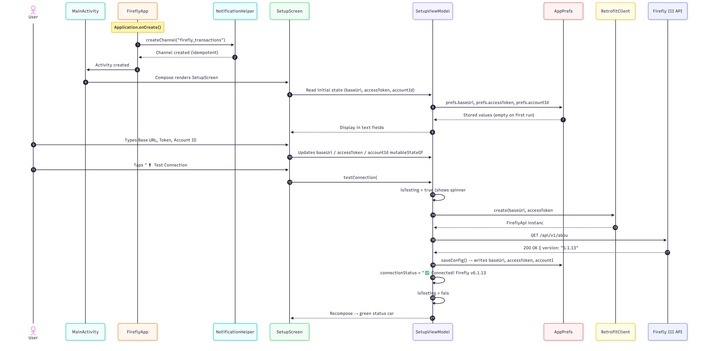
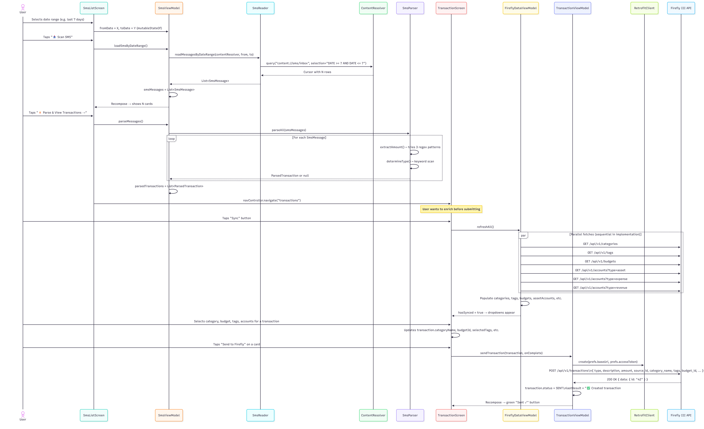
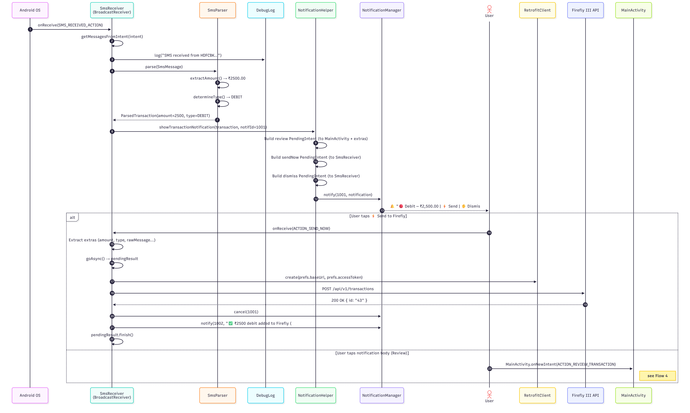
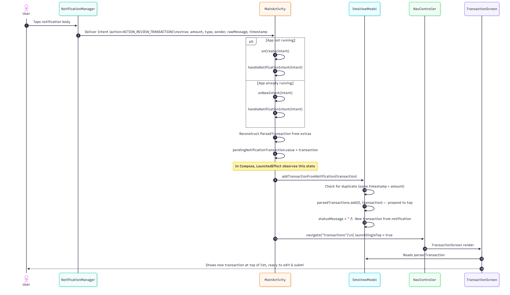
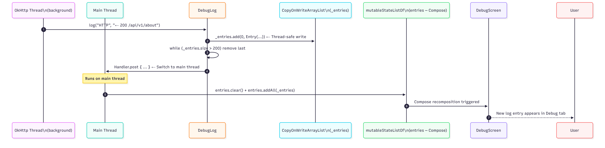

# 🔄 Data Flow

This document traces the exact path data takes through the system for every major user action. Each flow is self-contained — you can read only the one you need.

---

## Flow 1: App First Launch & Configuration

**Key points:**
- `testConnection()` runs inside `viewModelScope.launch {}` — it's a suspend call on `Dispatchers.Main` that calls a `suspend fun` inside
- `saveConfig()` is only called on **successful** connection test, not on manual "Save" (which can be triggered independently)
- The `isTesting` flag controls a `CircularProgressIndicator` — mutations are main-thread safe because they happen inside the coroutine body which executes on `Dispatchers.Main` by default

---

## Flow 2: Manual SMS Scan → Parse → Submit

---

## Flow 3: Live SMS → Notification → Auto-Send

---

## Flow 4: Notification Tap → Edit in App

---

## Flow 5: DebugLog — Multi-Thread Safety

This flow explains how `DebugLog` receives log calls from background threads (OkHttp interceptors, `SmsReceiver` coroutines) without crashing the Compose snapshot system.

**Why two lists?** The `CopyOnWriteArrayList` (`_entries`) acts as the truth — it's safe to write from any thread. The `mutableStateListOf` (`entries`) is the Compose-observable view — it's only ever written from the main thread. The `postToMain` helper checks `Looper.myLooper()` so if the call already originates from the main thread (e.g. from a ViewModel), the `Handler.post` overhead is skipped.

---

## State Ownership Map

| State | Owner | How UI reads it |
|---|---|---|
| `baseUrl`, `accessToken`, `accountId` | `SetupViewModel` | `mutableStateOf` (observable by delegation) |
| `connectionStatus`, `isTesting` | `SetupViewModel` | `mutableStateOf` |
| `smsMessages` | `SmsViewModel` | `mutableStateListOf` |
| `parsedTransactions` | `SmsViewModel` | `mutableStateListOf` |
| `fromDate`, `toDate` | `SmsViewModel` | `mutableStateOf` |
| `lastResult` | `TransactionViewModel` | `mutableStateOf` |
| `categories`, `tags`, `budgets`, `*Accounts` | `FireflyDataViewModel` | `mutableStateListOf` |
| `hasSynced`, `isLoading`, `lastSyncStatus` | `FireflyDataViewModel` | `mutableStateOf` |
| `entries`, `lastRequest`, `lastResponse` | `DebugLog` (singleton) | `mutableStateListOf` / `mutableStateOf` |
| `pendingNotificationTransaction` | `MainActivity` | `mutableStateOf` (passed to `MainApp`) |
