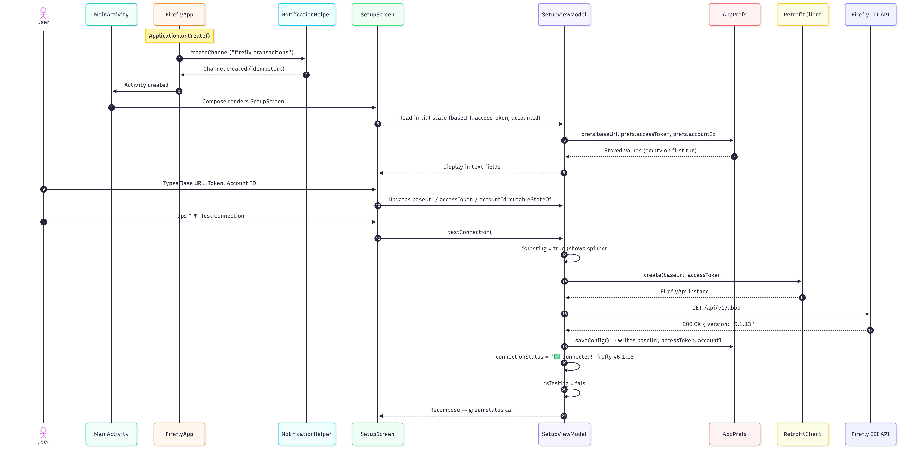
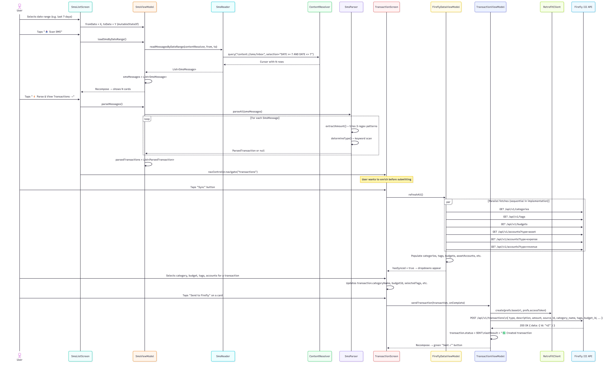
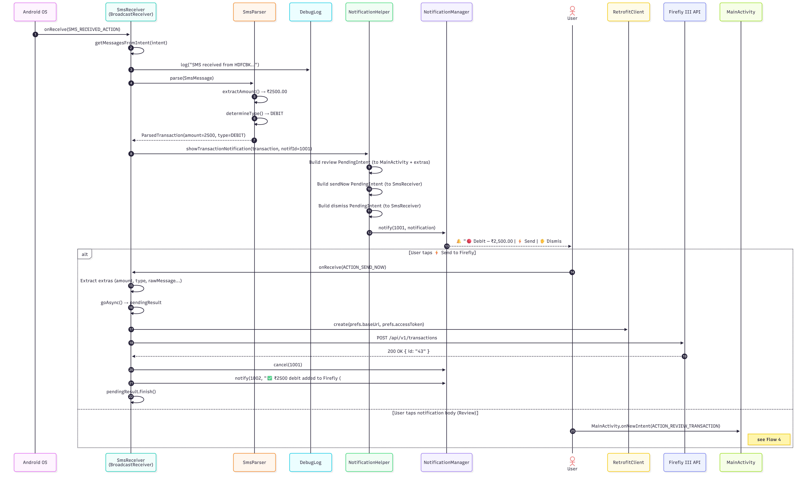
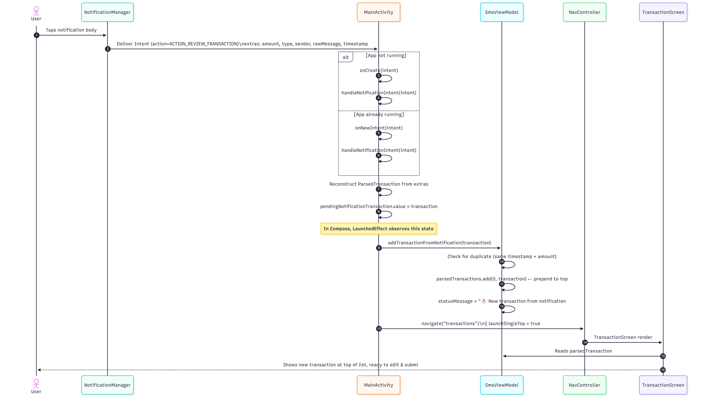
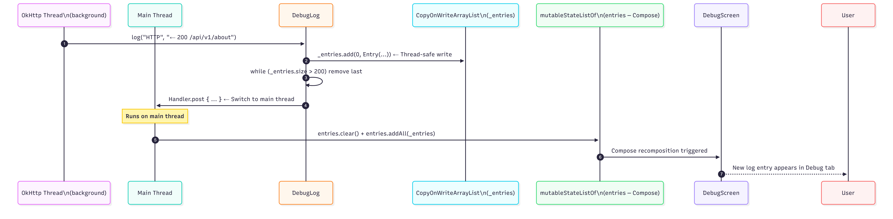

# 🔄 Data Flow

This document traces the exact path data takes through the system for every major user action. Each flow is self-contained — you can read only the one you need.

---

## Flow 1: App First Launch & Configuration



**Key points:**
- `testConnection()` runs inside `viewModelScope.launch {}` — it's a suspend call on `Dispatchers.Main` that calls a `suspend fun` inside
- `saveConfig()` is only called on **successful** connection test, not on manual "Save" (which can be triggered independently)
- The `isTesting` flag controls a `CircularProgressIndicator` — mutations are main-thread safe because they happen inside the coroutine body which executes on `Dispatchers.Main` by default

---

## Flow 2: Manual SMS Scan → Parse → Submit



---

## Flow 3: Live SMS → Notification → Auto-Send



---

## Flow 4: Notification Tap → Edit in App



---

## Flow 5: DebugLog — Multi-Thread Safety

This flow explains how `DebugLog` receives log calls from background threads (OkHttp interceptors, `SmsReceiver` coroutines) without crashing the Compose snapshot system.



**Why two lists?** The `CopyOnWriteArrayList` (`_entries`) acts as the truth — it's safe to write from any thread. The `mutableStateListOf` (`entries`) is the Compose-observable view — it's only ever written from the main thread. The `postToMain` helper checks `Looper.myLooper()` so if the call already originates from the main thread (e.g. from a ViewModel), the `Handler.post` overhead is skipped.

---

---

## Flow 6: Bi-Directional Reconciliation (`FireflySyncEngine`)

```
App Launch (>12h) / Tap Sync Button
          │
          ▼
HomeScreen / MainActivity
          │ calls reconcile()
          ▼
FireflySyncEngine
          │
          ├── 1. dao.getRecordsSince(cutoffMillis) ────────► Retrieve local Room records
          │
          ├── 2. api.listTransactions(start, end, page) ──► Query Firefly III across pages
          │
          ├── 3. Primary Pass: Match notes (smsHash=...)
          │      └── Local record found?
          │           ├── Update metadata (category, tags, description, accounts, budget)
          │           ├── Transition status (PENDING/FAILED -> SENT)
          │           └── Record remote transaction group ID & journal ID
          │
          ├── 4. Secondary Pass: Fuzzy match (amount + type + 24h window)
          │      └── Heuristic match found?
          │           └── Update metadata and set status to SENT
          │
          ▼
Room DB (sms_records updated)
          │
          ▼
SmsHistoryViewModel (UI auto-refreshes via Room Flow)
```

---

## Flow 7: In-App Transaction Update (`PUT /api/v1/transactions/{id}`)

```
User taps SENT transaction card
          │
          ▼
TransactionEditorSheet opens
          │ User edits category, tags, description, accounts, or budget
          ▼
User taps "Update in Firefly"
          │
          ▼
TransactionViewModel.updateTransaction()
          │
          ├── Creates FireflyTransactionRequest with transaction_journal_id
          │
          ├── Calls api.updateTransaction(fireflyTransactionId, request)
          │        │
          │        ├── HTTP 200 OK ──────► Update Room DB with new metadata
          │        │
          │        └── HTTP 404 (Deleted) ─► Fallback to createTransaction() (POST)
          │                                   └── Save newly generated ID to Room DB
          ▼
SmsRecordDao.markSentWithMetadata(...)
          │
          ▼
UI updates with latest synced state
```

---

## State Ownership Map

| State | Owner | How UI reads it |
|---|---|---|
| `baseUrl`, `accessToken`, `accountId` | `SetupViewModel` | `mutableStateOf` (observable by delegation) |
| `connectionStatus`, `isTesting` | `SetupViewModel` | `mutableStateOf` |
| `smsMessages` | `SmsViewModel` | `mutableStateListOf` |
| `parsedTransactions` | `SmsViewModel` | `mutableStateListOf` |
| `fromDate`, `toDate`, `selectedFilter` | `SmsViewModel` | `mutableStateOf` |
| `lastResult`, `isUpdating` | `TransactionViewModel` | `mutableStateOf` |
| `categories`, `tags`, `budgets`, `*Accounts` | `FireflyDataViewModel` | `mutableStateListOf` |
| `hasSynced`, `isLoading`, `lastSyncStatus` | `FireflyDataViewModel` | `mutableStateOf` |
| `historyRecords`, `syncSummary`, `isSyncing` | `SmsHistoryViewModel` | `StateFlow` / `collectAsStateWithLifecycle()` |
| `rules` | `RulesViewModel` | `StateFlow` / `collectAsState()` |
| `entries`, `lastRequest`, `lastResponse` | `DebugLog` (singleton) | `mutableStateListOf` / `mutableStateOf` |
| `pendingNotificationTransaction` | `MainActivity` | `mutableStateOf` (passed to `MainApp`) |
