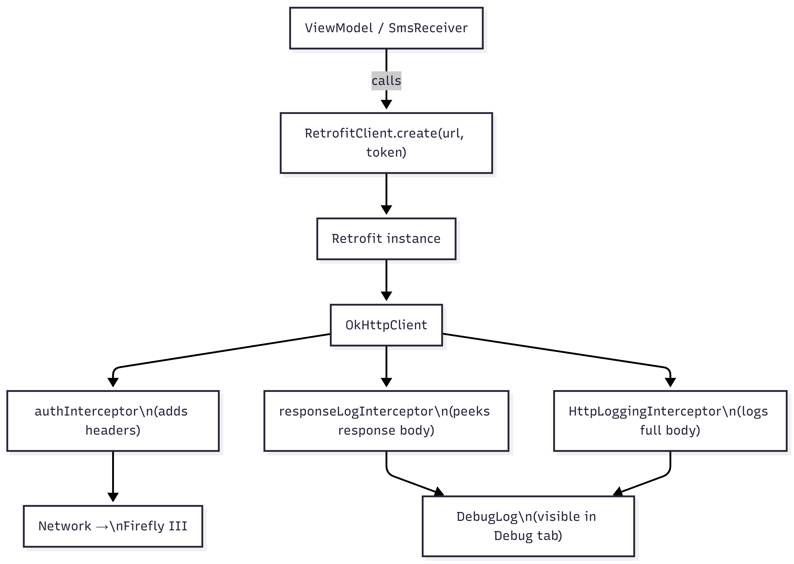
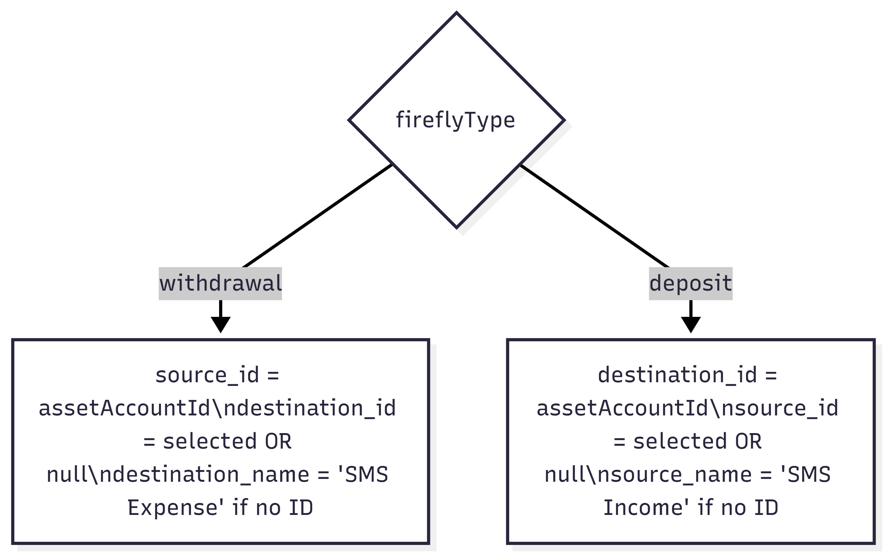

# 🌐 Firefly III Integration

This document covers everything about how the app communicates with a Firefly III instance — authentication, the HTTP client, every endpoint used, and the exact request/response shapes.

---

## Authentication

All requests use **Bearer Token** authentication via a Personal Access Token (PAT).

```
Authorization: Bearer <your-personal-access-token>
Accept: application/json
Content-Type: application/json
```

These headers are injected automatically by the `authInterceptor` in `RetrofitClient` — you never need to add them manually.

### How to generate a Personal Access Token

1. Log in to your Firefly III instance
2. Go to **Profile** (top-right avatar) → **OAuth**
3. Under "Personal Access Tokens", click **Create new token**
4. Give it a name (e.g. "SMS Scanner Android")
5. Copy the full token — you cannot see it again after closing the dialog

---

## HTTP Client Architecture



### Interceptor Order Matters

OkHttp applies interceptors in the order they are added:

1. **`authInterceptor`** — added first, so it runs before the request is sent. It adds the auth headers and logs the request to `DebugLog`.
2. **`responseLogInterceptor`** — runs after the response arrives. Uses `peekBody(10240)` to read up to 10 KB of the response body **without consuming it** (so Retrofit's Gson converter can still read it).
3. **`HttpLoggingInterceptor`** — logs the full request/response at `BODY` level to both `DebugLog` and Android's `Logcat`.

### Timeouts

All three timeout types are set to **30 seconds**:
- `connectTimeout` — time to establish TCP connection
- `readTimeout` — time waiting for server to send bytes
- `writeTimeout` — time to send the request body

These are generous to accommodate slow self-hosted instances over VPN.

### Base URL Handling

```kotlin
val url = if (baseUrl.endsWith("/")) baseUrl else "$baseUrl/"
```

Retrofit requires the base URL to end with `/`. This normalisation happens in `RetrofitClient.create()` so users don't have to worry about trailing slashes.

---

## API Endpoints

### `GET /api/v1/about`

**Used for:** Connection testing in `SetupViewModel.testConnection()`

**Response shape:**
```json
{
  "data": {
    "version": "6.1.13",
    "api_version": "2.0.0",
    "os": "Linux"
  }
}
```

**Kotlin model:** `FireflyAboutResponse` → `FireflyAboutData`

---

### `GET /api/v1/accounts`

**Used for:** `FireflyDataViewModel.fetchAccounts()` (called 3 times with different `type` params)

**Query parameters:**

| Parameter | Values used | Purpose |
|---|---|---|
| `type` | `"asset"`, `"expense"`, `"revenue"` | Filter account type |
| `limit` | `100` | Max accounts returned (pagination not implemented yet) |

**Response shape (abbreviated):**
```json
{
  "data": [
    {
      "id": "1",
      "attributes": {
        "name": "HDFC Savings",
        "type": "asset",
        "account_number": "XXXX1234",
        "current_balance": "45231.50"
      }
    }
  ]
}
```

**Kotlin models:** `FireflyAccountsResponse` → `List<FireflyAccountWrapper>` → `FireflyAccountAttributes`

**Simplified for UI:** `FireflyAccount(id, name, type)`

---

### `GET /api/v1/categories`

**Used for:** `FireflyDataViewModel.fetchCategories()`

**Query parameters:** `limit=100`

**Response shape:**
```json
{
  "data": [
    {
      "id": "3",
      "attributes": {
        "name": "Food & Dining"
      }
    }
  ]
}
```

**Kotlin models:** `FireflyCategoriesResponse` → `List<FireflyCategoryWrapper>` → `FireflyCategoryAttributes`

**Simplified for UI:** `FireflyCategory(id, name)`

---

### `GET /api/v1/tags`

**Used for:** `FireflyDataViewModel.fetchTags()`

**Note:** Tag names in Firefly III are stored in `attributes.tag` (not `attributes.name`).

**Response shape:**
```json
{
  "data": [
    {
      "id": "7",
      "attributes": {
        "tag": "emi",
        "date": null,
        "description": null
      }
    }
  ]
}
```

**Kotlin models:** `FireflyTagsResponse` → `List<FireflyTagWrapper>` → `FireflyTagAttributes`

**Simplified for UI:** `FireflyTag(id, name)` — note: `name` is mapped from `attributes.tag`

---

### `GET /api/v1/budgets`

**Used for:** `FireflyDataViewModel.fetchBudgets()`

Only **active** budgets (`attributes.active != false`) are kept.

**Response shape:**
```json
{
  "data": [
    {
      "id": "2",
      "attributes": {
        "name": "Groceries",
        "active": true
      }
    }
  ]
}
```

**Kotlin models:** `FireflyBudgetsResponse` → `List<FireflyBudgetWrapper>` → `FireflyBudgetAttributes`

**Simplified for UI:** `FireflyBudget(id, name)`

---

### `POST /api/v1/transactions`

**Used for:** `TransactionViewModel.sendTransaction()` and `SmsReceiver.handleSendNow()`

This is the most important endpoint. It creates a new transaction in Firefly III.

**Full request body shape:**
```json
{
  "error_if_duplicate_hash": false,
  "apply_rules": true,
  "transactions": [
    {
      "type": "withdrawal",
      "description": "SMS: INR 2,500.00 debited from a/c **1234 at POS AMAZON",
      "amount": "2500.00",
      "date": "2025-01-15T10:30:00+05:30",
      "source_id": "1",
      "destination_name": "SMS Expense",
      "notes": "Auto-parsed from SMS:\n[full SMS body]",
      "category_name": "Shopping",
      "tags": ["amazon", "online"],
      "budget_id": "2"
    }
  ]
}
```

**Key field notes:**

| Field | Type | Notes |
|---|---|---|
| `type` | `"withdrawal"` or `"deposit"` | Derived from `TransactionType.toFireflyType()` |
| `amount` | `String` | Formatted as `"%.2f"` in US locale — always has exactly 2 decimal places |
| `date` | `String` | ISO 8601 with timezone: `"yyyy-MM-dd'T'HH:mm:ssXXX"` in `Locale.US` |
| `source_id` | `String?` | Asset account ID (for withdrawals — where money comes from) |
| `destination_id` | `String?` | Asset account ID (for deposits — where money goes to) |
| `destination_name` | `String?` | Free-text destination name when no ID (creates expense account on Firefly side) |
| `source_name` | `String?` | Free-text source name when no ID (creates revenue account on Firefly side) |
| `category_name` | `String?` | Category by name (Firefly creates it if it doesn't exist) |
| `tags` | `List<String>?` | Tag names (Firefly creates tags that don't exist) |
| `budget_id` | `String?` | Budget by ID |

**Source/Destination logic:**



**Successful response:**
```json
{
  "data": {
    "id": "42",
    "type": "transactions"
  }
}
```

**Error response (HTTP 422):**
```json
{
  "message": "The given data was invalid.",
  "errors": {
    "transactions.0.amount": ["The amount must be greater than 0."],
    "transactions.0.date": ["The date field is required."]
  }
}
```

---

## Firefly III API Versioning

The app targets **Firefly III API v2** (route prefix `/api/v1/`). The API has been stable at this path since Firefly III v5. If your instance is older than v5.0, some endpoints may not exist.

To check your API version, the `GET /api/v1/about` response includes `api_version`.

---

## Pagination (Current Limitation)

All list endpoints (`categories`, `tags`, `budgets`, `accounts`) are fetched with `limit=100`. Firefly III paginates by default, but the app does **not** implement pagination cursor following. Users with more than 100 of any resource will see incomplete lists.

This is a tracked issue — contributions to add pagination are welcome.

---

## Self-Signed SSL Certificates

The app sets `android:usesCleartextTraffic="true"` in the manifest, which allows HTTP (unencrypted) connections. This is intentional for local network Firefly instances accessed over HTTP.

For HTTPS with a **self-signed certificate**, OkHttp will reject the connection by default. A future enhancement would allow users to trust a custom certificate or disable SSL verification (for internal networks only). Do not disable SSL verification in production.

---

## Debugging API Calls

Every request and response is logged to:
1. **Debug tab** in the app — visible without any tools
2. **Android Logcat** — tagged as `FF_OkHttp`, `FF_HTTP`, `FF_RetrofitClient`

The response body is peeked (up to 10 KB) without consuming it, so Gson can still parse the response normally. This is why we use `response.peekBody(10240).string()` in the `responseLogInterceptor`.
