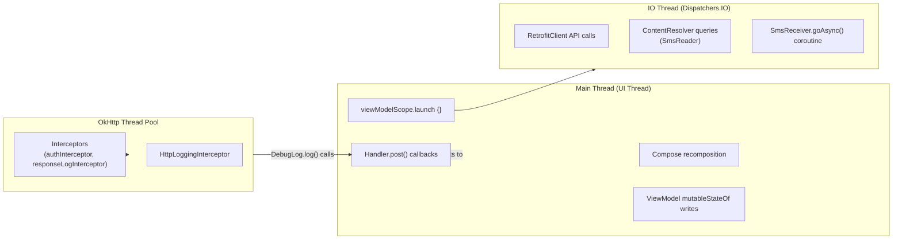

# 🧵 Threading Model

Android development has strict threading rules. This document explains every threading decision in the project, why it was made, and how to avoid introducing threading bugs when contributing.

---

## The Golden Rules

| Rule | Reason |
|---|---|
| **Never mutate Compose `mutableState` from a non-main thread** | Compose's snapshot system throws `IllegalStateException` |
| **Never do network I/O on the main thread** | Causes `NetworkOnMainThreadException` and ANRs |
| **Always use `goAsync()` in BroadcastReceiver for async work** | Without it, Android kills the receiver after `onReceive()` returns |
| **Use `viewModelScope.launch {}` for ViewModel coroutines** | Tied to ViewModel lifecycle — auto-cancelled when ViewModel is cleared |

---

## Thread Zones



---

## Coroutines: Where They Run

All coroutines in ViewModels use the default dispatcher (`Dispatchers.Main`) inherited from `viewModelScope`. The actual network calls are suspend functions from Retrofit, which run on OkHttp's thread pool transparently.

```kotlin
// In any ViewModel:
viewModelScope.launch {
    // This block runs on Dispatchers.Main (by default)

    val response = api.getCategories()
    // ↑ Retrofit suspend function — internally dispatches to OkHttp threads
    // ↑ Returns result to Dispatchers.Main when done

    categories.addAll(items)
    // ↑ This runs on Main — safe for Compose mutableState
}
```

No explicit `withContext(Dispatchers.IO)` is needed for Retrofit calls because Retrofit's coroutine adapter handles the thread switching internally.

---

## The `DebugLog` Threading Problem (and Solution)

`DebugLog` receives calls from multiple threads:

| Caller | Thread |
|---|---|
| `RetrofitClient.authInterceptor` | OkHttp thread |
| `RetrofitClient.responseLogInterceptor` | OkHttp thread |
| `HttpLoggingInterceptor` callback | OkHttp thread |
| All ViewModels | Main thread (via `viewModelScope`) |
| `SmsReceiver.handleSendNow()` coroutine | `Dispatchers.IO` |

If any of these directly mutated `mutableStateListOf<Entry>()`, it would throw:

```
java.lang.IllegalStateException: Snapshot is already applied
  at androidx.compose.runtime.snapshots.SnapshotKt.notifyWrittenState(Snapshot.kt:...)
```

### The Solution: Two-Stage Write

```
                    Any Thread: DebugLog.log()
                              │
              ┌───────────────┴───────────────┐
              │ [1] thread-safe write          │ [2] post to main
              ▼                               ▼
  CopyOnWriteArrayList              Handler(Looper.getMainLooper())
      (_entries)                           .post { }
    cap at 200                               │
                                    [3] runs on Main Thread only
                                             │
                                             ▼
                                   mutableStateListOf (entries)
                                   [Compose-observable list]
                                             │
                                    [4] triggers recomposition
                                             │
                                             ▼
                                   DebugScreen updates
```

```kotlin
private fun postToMain(block: () -> Unit) {
    if (Looper.myLooper() == Looper.getMainLooper()) {
        block()       // Already on main — execute immediately
    } else {
        mainHandler.post(block)  // Post to main thread queue
    }
}
```

The `if (Looper.myLooper() == Looper.getMainLooper())` check avoids unnecessary `Handler.post()` overhead when the caller is already on the main thread (most ViewModel calls).

---

## `CopyOnWriteArrayList` vs `synchronized`

`CopyOnWriteArrayList` was chosen over `synchronized(lock) { }` for the backing list because:
- **Reads are lock-free** — iteration (for the `entries.addAll(_entries)` sync) never blocks even during concurrent writes
- **Writes create a copy** — the cost of creating a new array backing is acceptable given the low write frequency (one log entry per action)
- **No deadlock risk** — no nested lock acquisition is possible

The trade-off: `CopyOnWriteArrayList` has higher per-write cost than a plain `ArrayList`. This is fine for a debug log that writes at most a few times per second.

---

## `BroadcastReceiver` Threading

`BroadcastReceiver.onReceive()` is called on the **main thread** with a **10-second deadline**.

### For the incoming SMS handler

```kotlin
private fun handleIncomingSms(context: Context, intent: Intent) {
    // Runs on MAIN THREAD
    val messages = Telephony.Sms.Intents.getMessagesFromIntent(intent) ?: return

    for (smsMessage in messages) {
        // SmsParser.parse() is CPU-only (regex) — acceptable on main thread
        // (takes < 1ms per message)
        val transaction = SmsParser.parse(sms) ?: continue

        // NotificationHelper just builds objects and calls NotificationManager
        // — all synchronous, no I/O, safe on main thread
        NotificationHelper.showTransactionNotification(...)
    }
    // Total time on main: < 5ms typical — well within 10s budget
}
```

### For the "Send Now" handler

```kotlin
private fun handleSendNow(context: Context, intent: Intent) {
    // Runs on MAIN THREAD initially
    val pendingResult = goAsync()

    CoroutineScope(Dispatchers.IO).launch {
        // Now on IO thread — network call is safe
        try {
            val response = api.createTransaction(...)
            showResultNotification(...)    // NotificationManager is thread-safe
        } finally {
            pendingResult.finish()         // Must be called on ANY thread
        }
    }
    // onReceive() returns — but broadcast is not finished until pendingResult.finish()
}
```

**Why `CoroutineScope(Dispatchers.IO)` and not `viewModelScope`?**

`BroadcastReceiver` has no `ViewModel` and no `lifecycleScope`. The `CoroutineScope(Dispatchers.IO)` creates a standalone scope. The `pendingResult.finish()` in `finally` ensures the scope's lifetime is bounded — it will always finish (success or error) and signal Android.

---

## Common Threading Mistakes to Avoid

### ❌ Wrong: Mutating state from a callback

```kotlin
// In an OkHttp interceptor (OkHttp thread):
someComposeState.value = "new value"  // CRASH: IllegalStateException
```

### ✅ Correct: Post to main thread

```kotlin
Handler(Looper.getMainLooper()).post {
    someComposeState.value = "new value"  // Safe
}
```

### ❌ Wrong: Reading SMS on the main thread in a ViewModel

```kotlin
// In a ViewModel function (runs on main thread):
fun loadSms() {
    val messages = SmsReader.readMessagesByDateRange(...)  // BLOCKS main thread
}
```

### ✅ Correct: Run in a coroutine

```kotlin
fun loadSms() {
    viewModelScope.launch {
        // Even without withContext(IO), the suspend function will internally
        // use a thread-pool. For ContentResolver (non-suspend), use IO explicitly:
        val messages = withContext(Dispatchers.IO) {
            SmsReader.readMessagesByDateRange(...)
        }
        smsMessages.addAll(messages)  // Back on Main — safe
    }
}
```

> **Note:** The current `SmsViewModel.loadSmsByDateRange()` calls `SmsReader` without `withContext(Dispatchers.IO)`. This works because ViewModels run on `Dispatchers.Main.immediate` and the blocking I/O is fast enough in practice (SMS ContentResolver is local). A future improvement should add `withContext(Dispatchers.IO)` for correctness.

---

## Thread Safety Summary by Component

| Component | Is thread-safe? | Notes |
|---|---|---|
| `DebugLog` | ✅ Yes | `CopyOnWriteArrayList` + main-thread posting |
| `AppPrefs` | ✅ Yes | `SharedPreferences.apply()` is async; reads are from main |
| `SmsParser` | ✅ Yes | Pure function, no shared state |
| `SmsReader` | ✅ Yes | ContentResolver is thread-safe |
| `RetrofitClient.create()` | ✅ Yes | Creates a new instance each call |
| ViewModel `mutableStateOf` | ✅ Yes (if used correctly) | Must only be written on main thread |
| `ParsedTransaction` | ⚠️ Careful | `var` fields — only mutated from the UI thread in this app |
| `NotificationHelper` | ✅ Yes | `NotificationManagerCompat` is thread-safe |
