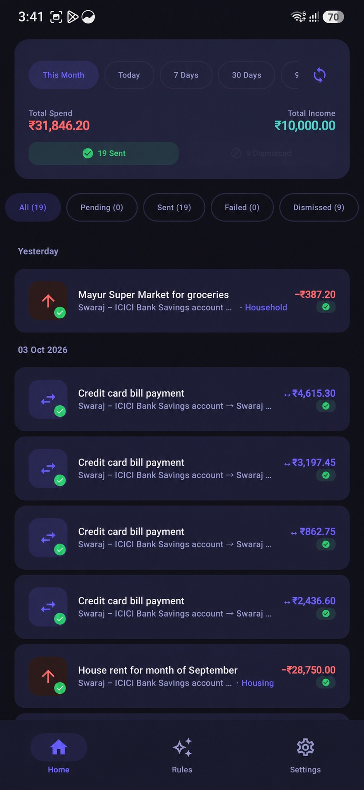
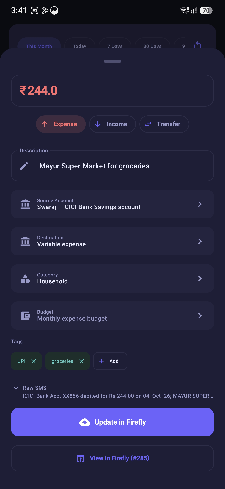
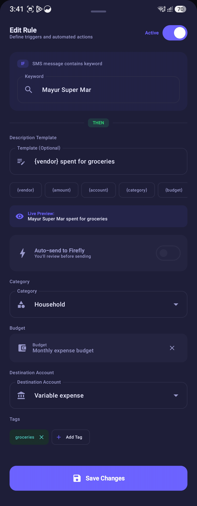
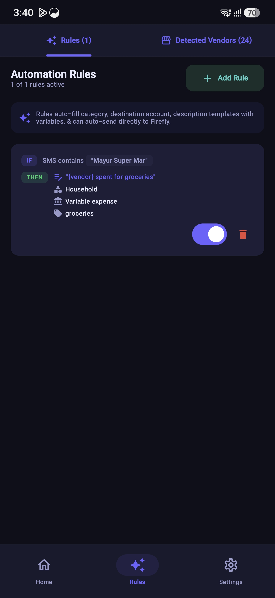
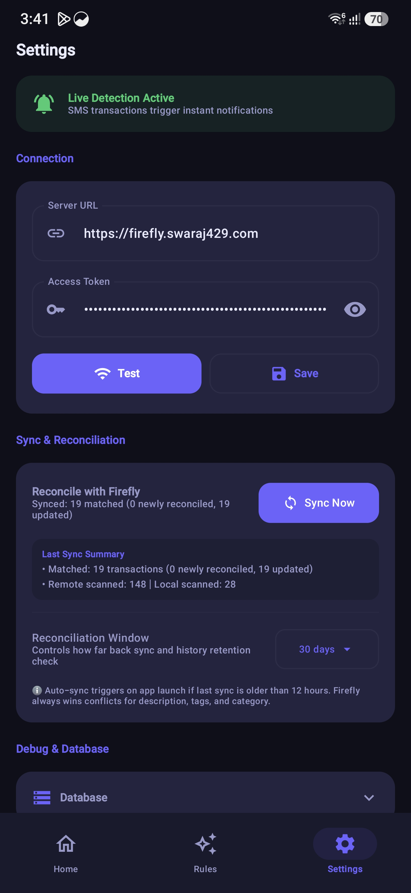
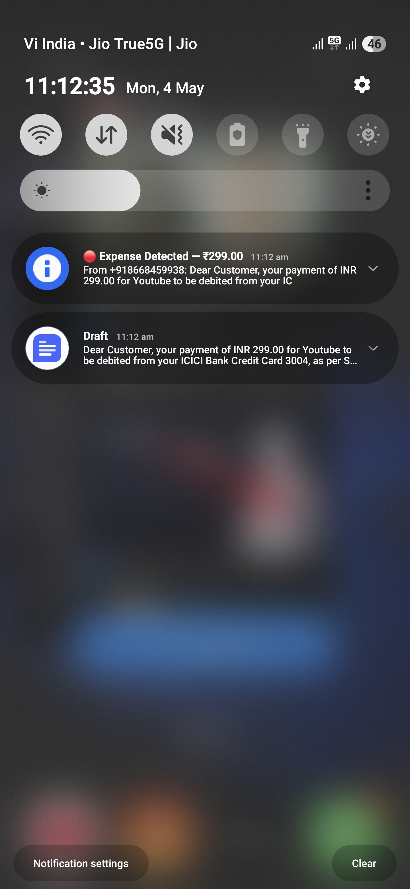

# 🚀 Release Announcement: Firefly III SMS Scanner v0.1.0-beta
## Public Beta Debut — Dynamic Rules, Vendor Discovery & Real-Time Sync

**Release Codename:** *Precision & Automation*  
**Milestone:** `v0.1.0-beta` (Build `6`)  
**Date:** October 5, 2026  
**License:** MIT  
**Compatibility:** Android 8.0 (API 26) or higher  
**Target Backend:** Firefly III v2.0+ (API v1)  
**Binary Package:** `firefly3-sms-scanner-v0.1.0-beta.apk`  
**Package SHA-256:** `f808fe8484140144672d378163a173ece3f77423da1d61e91e7d8628ea9a9d3b`  

---

## 📢 Executive Summary

We are beyond excited to announce **Firefly III SMS Scanner v0.1.0 (Beta)**! 

With this milestone release, the project officially transitions from experimental alpha status to a battle-tested **Public Beta**. After months of intensive testing across dozens of banking institutions and hundreds of transaction formats, the application has matured into a reliable, daily-driver companion for automating your personal finance tracking with [Firefly III](https://firefly-iii.org/).

**v0.1.0-beta** delivers our most ambitious feature set yet:
1. **Dynamic Categorization & Description Templating (`RuleEngine`):** Build powerful categorization rules with a brand-new **Material 3 Modal Rule Editor Sheet**, live interactive template previews, budget mapping, and 1-tap variable chips (`{vendor}`, `{amount}`, `{account}`, `{category}`, `{budget}`, `{date}`).
2. **Detected Vendors Directory (`VendorsViewModel`):** Automatically scan your SMS history to surface recurring merchants, review frequency and spend volume, and generate custom rules in a single tap.
3. **Flawless Real-Time SMS Processing (`SmsReceiver.goAsync`):** The incoming SMS receiver now executes asynchronously via coroutines on `Dispatchers.IO`, pulling cached asset accounts directly from Room before evaluating rules, guaranteeing exact asset account mapping on real-time notifications.
4. **Expanded Banking SMS Intelligence (`DescriptionExtractor`):** Deep parsing updates covering complex multiline alerts from Axis Bank, ICICI Bank credit cards, SBI Card, FASTag toll charges, Simpl PayLater, SIP mutual fund debits, and UPI merchant VPAs.
5. **Production Signed APK Release:** Official signed distribution APK with SHA-256 verification and automated Gradle signing architecture.

---

## 📸 Visual Showcase

<div align="center">

### ⭐ Unified Dashboard & Transaction Stream
*Real-time spend and income metrics, quick date-range filter chips, sync status pills, and live Firefly III decorator badges.*



</div>

<br>

| ✏️ Transaction Editor | 🪄 Dynamic Rule Editor | 🏪 Automation & Vendors | ⚙️ Settings & Reconciliation | 🔔 Real-Time Alert |
|:---:|:---:|:---:|:---:|:---:|
|  |  |  |  |  |
| **Transaction Editor**<br>In-app review, category & budget assignment, raw SMS inspection, and one-tap `PUT` update to Firefly. | **Rule Editor Sheet**<br>Dynamic description templates with variable chips (`{vendor}`, `{account}`), live preview card, and budget selector. | **Rules & Vendors**<br>Active automation rules with keyword/regex triggers and automated SMS inbox merchant discovery. | **Settings & True Sync**<br>Live detection status, server credential testing, and bi-directional reconciliation sync. | **Instant Notification**<br>Instant background detection alert with quick **Send to Firefly** and **Review** actions. |

---

## 🌟 Major Highlights & What's New

### 1. 🧠 Dynamic Rules Engine & Variable Templating (`RuleEngine`)
Previously, transaction descriptions were locked to raw bank strings or rigid vendor names. The new **`RuleEngine`** introduces dynamic string interpolation templates:

- **Smart Variable Interpolation:** Write templates like `"{vendor} ({account})"`, `"UPI to {vendor}"`, or `"{category} - {vendor} [{budget}]"`. At parse time, variables are evaluated and substituted automatically:
  - `{vendor}`: Extracted merchant or payee name (e.g., `Swiggy`, `Amazon`, `Uber`).
  - `{amount}`: Transaction decimal amount (e.g., `450.00`).
  - `{account}`: Matched asset account name or fallback mask (e.g., `HDFC Salary`, `Account ****4821`).
  - `{category}`: Firefly III category assigned to the transaction.
  - `{budget}`: Firefly III budget linked to the transaction.
  - `{date}`: Formatted transaction timestamp.
- **Budget Assignment:** Rules can now attach a Firefly III **Budget** directly to matching transactions, making monthly budget tracking completely hands-free.
- **Tag Association:** Attach multi-tag arrays to rules to label recurring expenses (e.g., `food-delivery`, `subscription`, `commute`).
- **Direct Auto-Send Mode:** For trusted recurring transactions (e.g., utility bills, streaming subscriptions), rules can enable the **Auto-Send** flag to submit them to Firefly III immediately without requiring interactive manual review.

---

### 2. 🎨 Reimagined `RuleEditorSheet` (Material 3 Modal Experience)
We completely retired the cramped, single-screen `AlertDialog` rule creator in favor of a full-featured, ergonomic `ModalBottomSheet`:

- **Live Template Preview Card:** As you type your custom description template or tap variable pills, a live preview card renders the exact final output in real time with sample transaction data.
- **1-Tap Variable Chips (`LazyRow`):** Never guess variable names again. A horizontal pill bar lets you tap chips like `+ {vendor}`, `+ {account}`, and `+ {amount}` to insert tokens directly at your cursor position.
- **Integrated Firefly Selectors:** 
  - Dynamic searchable dropdown for Firefly III **Expense Accounts**.
  - Dropdown for **Categories**.
  - Dedicated dropdown for **Budgets**.
  - Chip cloud for toggling project **Tags**.
- **Regex Testing & Keyword Chips:** Easily toggle between simple substring keywords and advanced regular expression matching.

---

### 3. 🏪 Detected Vendors Directory (`VendorsViewModel`)
Tired of manually discovering what payees your bank uses? The new **Detected Vendors Directory** analyzes your SMS inbox to surface merchant patterns:

- **Merchant Spend Aggregation:** Scans SMS messages to build a distinct list of detected vendors with their occurrence count, total expenditure, and last transaction date.
- **Rule Coverage Indicators:** Visual pills highlight whether a merchant is already covered by an existing rule or requires attention.
- **1-Tap "Create Rule" Action:** Tapping any vendor opens the `RuleEditorSheet` pre-populated with the merchant's name, suggested keywords, and a default template.

---

### 4. ⚡ Real-Time SMS Account Matching (`SmsReceiver.goAsync`)
In earlier versions, real-time SMS broadcasts occasionally defaulted to fallback accounts because Android's `BroadcastReceiver` lifecycle terminated before Room SQLite queries could resolve on the background thread.

We refactored `SmsReceiver` using Android's **`goAsync()` API**:
- **Asynchronous Execution:** Incoming SMS broadcasts now hold a `PendingResult` while dispatching asynchronous queries on `Dispatchers.IO`.
- **Cached Asset Account Lookup:** `AccountMatcher` queries the local `FireflyDatabase` cache, resolving the exact asset account before building the notification.
- **Deterministic Pipeline Execution:**
  ```
  Incoming SMS ➔ SmsParser ➔ AccountMatcher (Room DB) ➔ RuleEngine (Priority Override) ➔ Action Notification
  ```
  The `RuleEngine` is evaluated **last**, ensuring custom user rules have final authority to override asset accounts, categories, budgets, and templates.

---

### 5. 🏦 Expanded Banking SMS Parser Intelligence
Indian banking formats vary wildly across SMS gateways. We significantly expanded `DescriptionExtractor` and `SmsParser` with battle-tested regex patterns:

- **Axis Bank Multiline Debits:** Handles multi-line notifications with `Spent INR... at...`, `dr from A/C...`, and clean merchant extraction.
- **ICICI Bank Credit Cards:** Accurately parses the `Info: ...` segment on ICICI credit card debits while stripping terminal gateway strings.
- **SBI Card Variants:** Supports both standard debits and SBI Card SMS alerts with `Txn of Rs... on Card ending...`.
- **FASTag Toll Alerts:** Automatically detects automated toll debits (`FASTag account debited`, `Plaza Name: ...`).
- **PayLater & Digital Wallets:** Native support for **Simpl PayLater** (`debited for your transaction at...`) and Paytm/PhonePe gateway variants.
- **Mutual Fund SIPs & NACH Mandates:** Recognizes automated SIP debits and mandates.
- **UPI VPA Extraction:** Recognizes UPI strings like `UPI/P2M/...` and translates merchant VPAs into clean, legible titles.

---

### 6. 🛡️ Official Release APK & Automated Signing Architecture
With **v0.1.0-beta**, we transitioned from debug builds to a production-grade release pipeline:
- **Production Keystore Signing:** Configured release build signing via secure `keystore.properties` (kept strictly out of source control).
- **V1 + V2 Scheme Verification:** The APK is verified using Android SDK `apksigner` and byte-aligned with `zipalign -c 4`.
- **Zero Build Warnings:** Clean compilation across Kotlin 1.9.22 and Jetpack Compose BOM 2024.02.00 with all 28 JVM unit tests passing.

---

## 🏗️ Technical Architecture & Pipeline Flow

### Real-Time SMS Ingestion & Rule Pipeline
```
                    ┌─────────────────────────┐
                    │      Incoming SMS       │
                    └────────────┬────────────┘
                                 │
                                 ▼
                    ┌─────────────────────────┐
                    │   SmsReceiver.goAsync   │
                    │    (Dispatchers.IO)     │
                    └────────────┬────────────┘
                                 │
                  ┌──────────────┴──────────────┐
                  ▼                             ▼
       ┌────────────────────┐        ┌────────────────────┐
       │     SmsParser      │        │   AccountMatcher   │
       │ (Amount, Date, Tx) │        │ (Room DB Accounts) │
       └──────────┬─────────┘        └──────────┬─────────┘
                  │                             │
                  └──────────────┬──────────────┘
                                 │
                                 ▼
                    ┌─────────────────────────┐
                    │       RuleEngine        │
                    │   - Match Keywords/Regex│
                    │   - Override Category   │
                    │   - Assign Budget & Tags│
                    │   - Template Description│
                    └────────────┬────────────┘
                                 │
                     ┌───────────┴───────────┐
      [Auto-Send = true]                     [Auto-Send = false]
             │                                       │
             ▼                                       ▼
  ┌───────────────────────┐             ┌─────────────────────────┐
  │ FireflyApiClient.POST │             │  Action Notification    │
  │ (Direct Background)   │             │ (Quick-Submit / Review) │
  └───────────────────────┘             └─────────────────────────┘
```

### Key Components Introduced & Updated in this Release

| Component | Layer | Description |
|---|---|---|
| `RuleEngine` | `app.rules` | Evaluates regex/keyword matching rules, applies priority weighting, and interpolates dynamic string templates. |
| `RuleEditorSheet` | `app.ui.sheets` | Material 3 modal bottom sheet for creating and editing rules with live template previews, variable chips, and budget selectors. |
| `VendorsViewModel` | `app.viewmodel` | Aggregates unique merchants across SMS inbox history, tracking frequencies, total spend, and rule coverage. |
| `SmsReceiver` | `app.receiver` | Upgraded to `goAsync()` to fetch Room cached asset accounts and evaluate rules on `Dispatchers.IO`. |
| `DescriptionExtractor` | `app.parser` | Enhanced regex engine with specialized extractors for Axis, ICICI, SBI, FASTag, Simpl, SIP, and UPI formats. |
| `FireflyDatabase` | `app.db` | Room database schema maintaining transaction history, asset account cache, and categorization rules. |
| `SettingsScreen` | `app.ui.screens` | Added live build version, commit milestone identifier, and MIT license footer. |

---

## 📊 Full Changelog (v0.0.5-alpha ➔ v0.1.0-beta)

### 🚀 Features & Enhancements
- **Dynamic Description Templates:** Added `{vendor}`, `{amount}`, `{account}`, `{category}`, `{budget}`, and `{date}` variable tokens in `RuleEngine`.
- **Modal Rule Editor Sheet:** Replaced old dialog with scrollable Material 3 `ModalBottomSheet` featuring sticky action buttons and clean field grouping.
- **Live Template Preview:** Added real-time evaluation card in `RuleEditorSheet` to preview interpolated transaction titles before saving.
- **1-Tap Variable Chips:** Added horizontal chip bar in rule editor for inserting tokens directly into the template input field.
- **Budget Selection Support:** Linked Firefly III Budgets to categorization rules with dynamic dropdown selector.
- **Auto-Send Rule Mode:** Added toggle in rules to allow trusted recurring transactions to submit directly in the background.
- **Detected Vendors Directory:** Added merchant aggregator in `VendorsViewModel` to discover payees and generate rules in one tap.
- **Real-Time Asynchronous Processing:** Refactored `SmsReceiver` with `goAsync()` on `Dispatchers.IO` for reliable asset account matching.
- **Banking SMS Regex Overhaul:** Added support for Axis Bank multiline alerts, ICICI credit cards, SBI Card, FASTag tolls, Simpl PayLater, and UPI VPAs.
- **Subtle Settings Footer:** Added clean About section displaying live app version, build type, and open-source license.
- **Gradle Release Signing Pipeline:** Configured production APK signing via gitignored `keystore.properties`.

### 🐛 Bug Fixes & Improvements
- **Resolved Live SMS Account Matching Bug:** Fixed race condition where incoming notifications occasionally reverted to fallback account names due to asynchronous DB queries timing out.
- **Fixed Fallback Account Name Formatting:** Corrected account string generation to format masked numbers properly (e.g., `Account ****1234`).
- **Fixed JVM Unit Test Looper Exceptions:** Wrapped `DebugLog` Android `Looper.getMainLooper()` calls to ensure JVM test compatibility.
- **Enforced Pipeline Order:** Ensured `RuleEngine` executes after `AccountMatcher` so custom user rules always take precedence.
- **Fixed Compose Layout Clipping:** Resolved keyboard overlapping and scroll clipping issues in the rule editor by converting to a bottom sheet.

---

## 📦 APK Verification & Checksums

The release APK is cryptographically signed and verified using Android SDK tools. You can verify the integrity of the downloaded package before installation:

```bash
# Verify APK Signature
apksigner verify --verbose firefly3-sms-scanner-v0.1.0-beta.apk
# Verified using v1 scheme (JAR signing): true
# Verified using v2 scheme (APK Signature Scheme v2): true

# Verify SHA-256 Checksum
sha256sum firefly3-sms-scanner-v0.1.0-beta.apk
# f808fe8484140144672d378163a173ece3f77423da1d61e91e7d8628ea9a9d3b
```

| Property | Value |
|---|---|
| **Filename** | `firefly3-sms-scanner-v0.1.0-beta.apk` |
| **File Size** | `11 MB` (11,466,698 bytes) |
| **Version Name** | `0.1.0-beta` |
| **Version Code** | `6` |
| **Min SDK** | `26` (Android 8.0 Oreo) |
| **Target SDK** | `34` (Android 14) |
| **Signature Scheme** | V1 + V2 (Verified) |
| **SHA-256** | `f808fe8484140144672d378163a173ece3f77423da1d61e91e7d8628ea9a9d3b` |

---

## 🔒 Privacy & Security Guarantees

As a personal finance utility, privacy remains our highest priority:
- **100% On-Device Processing:** SMS parsing, regex matching, account correlation, and database operations occur exclusively on your physical device.
- **Zero Third-Party Telemetry:** No analytics libraries, crash reporters, tracking SDKs, or cloud services.
- **Direct Point-to-Point Communication:** Network communication occurs solely between your phone and your configured Firefly III server instance via HTTPS.
- **Explicit Credential Storage:** Personal Access Tokens and server URLs are stored in protected Android `SharedPreferences`.

---

## 📥 Getting Started & Upgrade Notes

### Upgrading from v0.0.5-alpha (or earlier)
1. Download `firefly3-sms-scanner-v0.1.0-beta.apk` from the [GitHub Releases](https://github.com/swaraj429/firefly-3-sms-auto-scanner/releases) page.
2. Install the APK over your existing installation. Your existing database, settings, and rules will be preserved automatically.
3. Open the app and navigate to **Settings** ➔ Tap **Sync Accounts & Categories** to refresh your Firefly III asset accounts, categories, and budgets.
4. Navigate to the **Rules** tab to explore the new **Rule Editor Sheet** and take advantage of dynamic description templates!

### New Installations
1. Install the APK and launch the app.
2. Grant the requested **SMS** and **Notification** permissions.
3. Head to the **Settings** tab, enter your Firefly III instance URL and Personal Access Token, and tap **Test Connection**.
4. Tap **Sync Accounts** to fetch your Firefly accounts.
5. Tap **Scan Inbox** on the Home tab to load your recent transactions!

---

## 💬 Community, Support & Feedback

As we enter **Public Beta**, we are committed to actively supporting users, addressing edge cases, and adding parsers for new banks:

- **Encountered an unsupported SMS format?** Open an issue with the sanitized SMS message (masking account numbers, balances, and names) on our [Issue Tracker](https://github.com/swaraj429/firefly-3-sms-auto-scanner/issues).
- **Have an idea or feature request?** Start a discussion or submit a Pull Request. We welcome community contributions!
- **Explore the Documentation:** Check out our newly updated [Documentation Directory](https://github.com/swaraj429/firefly-3-sms-auto-scanner/tree/main/docs) covering architecture, data flow, and parser extension guides.

---

## 🗺️ What's Next on the Roadmap

With the Beta foundation firmly in place, our upcoming releases will focus on:
- **Glanceable Home Screen Widget:** Daily spend overview and pending transaction counter powered by Jetpack Glance.
- **Split Transaction Support:** Multi-category splits for grocery and department store purchases.
- **Multi-Currency Conversion:** Automatic conversion handling for foreign currency transactions.
- **F-Droid Inclusion:** Preparation for official packaging and distribution on F-Droid.

---

<div align="center">

**Enjoying Firefly III SMS Scanner?**  
⭐ Give us a star on GitHub: [swaraj429/firefly-3-sms-auto-scanner](https://github.com/swaraj429/firefly-3-sms-auto-scanner)  

*Built with ❤️ for the self-hosted personal finance community.*

</div>
